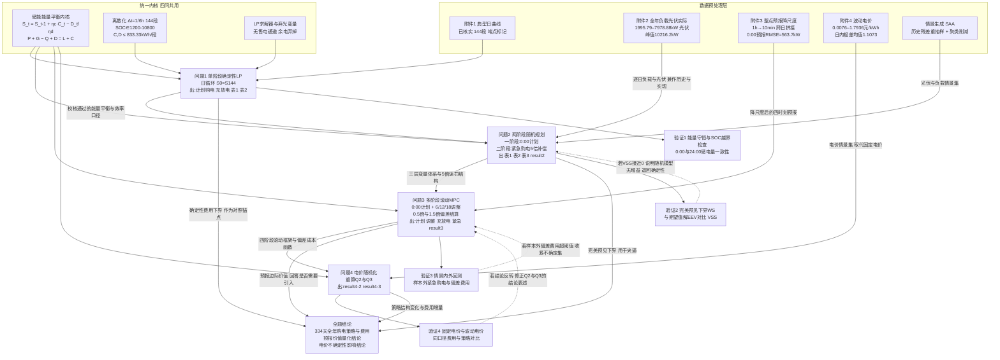

# C题 微网与外部电网电力调控策略 — 全文建模主线与分问选型

> 输入依据：《C题-题意逐句翻译.md》的台账、隐藏条件、输入输出表与跨问题联动链。
> 数据依据：附件 1–4 已实测（见 §3 口径表中的实测值）。
> 本文只给**建模路线与选型比较**，不给出任何数值结果；所有数值型结论均需在求解后填入。

---

## 1. 整题建模主线

### 1.1 研究对象与中心矛盾

研究对象是一个**受物理约束的储能时移系统**，其经济价值全部来自于"把电从便宜的时刻搬到贵的时刻"。中心矛盾是三重的：

1. **时间耦合 vs 决策时点固定**：储能 SOC 是状态变量，今天 24:00 的电量就是明天 0:00 的电量；但所有计划都必须在 0:00 一次性敲定。
2. **信息不完备 vs 结算刚性**：费用按**计划购电量**结算（不是按实际用量），而制定计划时只能拿到预报；计划偏多白付，计划偏少按 5 倍 / 1.5 倍补。
3. **确定性最优 vs 随机现实**：问题 1 是确定性理想世界，问题 2/3 引入源荷不确定性，问题 4 再引入电价不确定性。

### 1.2 推荐的主干模型（贯穿全文的统一骨架）

**一条骨架打四问：以 10 分钟步长的储能能量平衡方程为内核的"计划—实现—结算"三层优化链，外层按问题逐层叠加不确定性处理。**

骨架的**不变内核**（四问共用，一字不改）：

| 组成 | 形式 |
|---|---|
| 时段与步长 | $t=1,\dots,144$，$\Delta t=1/6\ \text{h}$ |
| 状态变量 | $S_t$：第 $t$ 段末储电量（kWh） |
| 状态转移 | $S_t=S_{t-1}+\eta_c C_t-D_t/\eta_d$ |
| 功率平衡 | $P_t^{buy}+(G_t-Q_t)+D_t=L_t+C_t$（购电 + 光伏可用 + 放电 = 负载 + 充电） |
| 硬约束 | $1200\le S_t\le 10800$；$0\le C_t,D_t\le 833.33$；$P_t^{buy},E_t,Q_t\ge 0$ |
| 目标基元 | $\min\ \sum_t p_t P_t^{plan}$（按**计划量**结算） |

骨架的**逐问叠加层**：

| 问题 | 叠加内容 | 数学形态变化 |
|---|---|---|
| 问题 1 | 日循环边界 $S_0=S_{144}$ | 单阶段确定性 LP |
| 问题 2 | 随机变量 $G_t$（光伏）与 $L_t$（负载）+ 紧急购电补偿变量 $E_t$（5 倍） | 两阶段随机规划（recourse = 紧急购电） |
| 问题 3 | 增加 6/12/18 时的决策节点 + 调整变量 $A_t$ + 0.5/1.5 倍偏差结算 | 多阶段随机规划 / 滚动时域 MPC |
| 问题 4 | 电价 $p_t$ 由确定序列变为随机序列 | 随机规划 / 鲁棒优化 / 预测+滚动 |

**为什么这条骨架能贯穿全文**：

- 它是**物理的**，不是统计的。能量守恒与 SOC 递推在任何一问中都不变，因此问题 1 校核正确的模拟器可以直接被问题 2/3/4 复用，避免了"每问一套模型、参数互不兼容"的典型断链。
- 它是**线性的**。储能模型中最容易出现的非线性（充放电互斥）在本题可用"成本为正 ⇒ 同时充放必非最优"直接消解，因此四问都可保持 LP/MILP 形态，求解器（HiGHS/CBC/Gurobi）可在秒级跑完 334 天 × 144 段。
- 它的**输出就是题目要的东西**。$P_t^{plan}$、$C_t$、$D_t$、$S_0/S_{144}$、$E_t$ 恰好一一对应 result 文件的五类工作表，不需要任何二次转换。

### 1.3 各问在全文中的角色

| 问题 | 角色 | 对全文的贡献 |
|---|---|---|
| 问题 1 | **基础 / 校核** | 验证能量平衡、SOC 递推、效率口径、弃光处理是否正确；产出确定性费用下界，作为后续所有改进的对照锚点 |
| 问题 2 | **扩展 / 不确定性入门** | 建立"计划—实现—结算"三层变量与紧急购电惩罚；产出**完美预见下界**（WS）与**期望值解**（EEV） |
| 问题 3 | **多阶段 / 信息价值** | 引入滚动修正；用 VSS / EVPI 量化"多引入三个时刻的预报"到底值多少钱，直接回答"是否需要引入" |
| 问题 4 | **参数升级 / 稳健性** | 把电价从参数升级为随机变量，检验问题 2/3 的结论在价格波动下是否反转 |

---

## 2. 跨问题联动链



---

## 3. 全文统一建模口径

| 符号 | 含义 | 单位 | 取值/范围 | 使用问题 |
|---|---|---|---|---|
| $t$ | 时段索引 | — | $1,\dots,144$ | 全部 |
| $\Delta t$ | 时段长度 | h | $1/6$ | 全部 |
| $\mathcal{D}$ | 结果期日期集 | — | 2025-02-01 … 2025-12-31，共 334 天 | 问题 2/3/4 |
| $L_t$ | 时段 $t$ 小区负载电量 | kWh | 全年瞬时功率 1995.72–7978.88 kW | 全部 |
| $G_t$ | 时段 $t$ 光伏发电电量 | kWh | 全年瞬时功率峰值 10216.2 kW；日电量 34 361–75 223 kWh | 全部 |
| $p_t$ | 时段 $t$ 交易电价 | 元/kWh | 附件 1：0.3713–1.3952；附件 4：0.0076–1.7936 | 全部 |
| $P_t$ | **计划**购电量（0:00 锁定，结算依据） | kWh | $\ge 0$ | 全部 |
| $A_t$ | **调整**购电量（6/12/18 时重定） | kWh | $\ge 0$，已执行时段不可改 | 问题 3/4 |
| $E_t$ | **紧急**购电量（缺口被动补齐） | kWh | $\ge 0$，单价 $5p_t$ | 问题 2/3/4 |
| $C_t$ / $D_t$ | 时段 $t$ 充电量 / 放电量 | kWh | $[0,\ 833.33]$（= 5000 kW × 1/6 h） | 全部 |
| $Q_t$ | 弃光电量 | kWh | $\ge 0$，无收益 | 全部 |
| $S_t$ | 时段 $t$ 末储电量 | kWh | $[1200,\ 10800]$ | 全部 |
| $S^{\max},S^{\min}$ | 运行 SOC 上/下限 | kWh | 10800 / 1200（可用容量 9600） | 全部 |
| $S_{\text{cap}}$ | 物理容量 | kWh | 12000 | 全部 |
| $\overline{P}$ | 最大充放电功率 | kW | 5000 → 每段 833.33 kWh | 全部 |
| $\eta_c,\eta_d$ | 充/放电效率 | — | 主口径 0.90 / 0.90；对照 0.9487 / 0.9487 | 全部 |
| $S_{\text{init}}$ | 初始储电量 | kWh | 6000（2025-01-01 0:00） | 全部 |
| $\omega$ | 随机情景索引 | — | 情景集 $\Omega$，$|\Omega|$ 由 SAA 确定 | 问题 2/3/4 |
| $\pi_\omega$ | 情景概率 | — | $\sum_\omega\pi_\omega=1$ | 问题 2/3/4 |
| $J$ | 全天总购电费用 | 元 | $=J^{plan}+J^{emg}+J^{adj}$ | 全部 |

**预处理统一规则**

1. 时间轴：每天 144 段，列名 `00:10 … 23:50, 0:00+1`，按**区间右端点**读取；`0:00+1` 即 24:00。
2. 功率 → 电量：所有 kW 列乘以 $\Delta t=1/6$ 得到 kWh；表 1/表 2 一律报 kWh。
3. 附件 3 降尺度：24 个整点值 → 线性插值到 144 个 10 分钟点；对齐口径取"预报第 $k$ 小时 ↔ 实际区间 $[k-1,k)$"（该口径下 0:00 预报全年 RMSE ≈ 563.7 kW，优于错开一小时的 693.8 kW）。
4. 跨日拼接：6:00/12:00/18:00 发布的 24 小时预报有 18/12/6 小时落到次日，须按日期偏移写入次日序列。
5. 弃光：当 $G_t-L_t > \overline{P}\Delta t$ 且储能已近满时，多余部分计入 $Q_t$；全年约 241 个时段（0.46%）必然弃光。
6. 无售电：不设上网电价与售电变量。

---

## 4. 分问题求解思路

### 4.1 问题 1

#### 4.1.1 问题概述

- **任务**：在电价与负载曲线每天相同、光伏给出一天预测数据的条件下，于每天 0:00 制定当天 0:00–24:00 的逐 10 分钟计划购电量与储能充放电量。
- **已知**：附件 1 的三条典型日曲线（电价 0.3713–1.3952 元/kWh、负载 3309–5959 kW、光伏峰值 7612 kW、日光伏电量 55 483 kWh、日负载电量 111 025 kWh）；附录 1 的储能参数。
- **输出**：表 1（6 个指定 10 分钟时段购电量 + 全天购电量 + 全天购电费）、表 2（6 个 4 小时段的充/放电量 + 0:00 与 24:00 储电量）、result1.xlsx（144 段完整策略）。
- **本质**：带状态递推的**确定性单阶段线性规划**（储能调度 / 电力套利问题族）。本质是 LP 而非一般 NLP，因为能量平衡、SOC 递推、功率与容量约束全为线性；唯一的离散性（充放电互斥）在成本为正时由最优性自动排除。

**题给条件 vs 新增假设**：日循环 $S_0=S_{144}$ 是**题给**；"充放电不同时进行"、$\eta$ 口径、"无售电、余电弃掉"是**新增假设**，须显式列出。

#### 4.1.2 总体求解思路

1. 读附件 1，按 144 段构造 $p_t, L_t, G_t$（kWh）。
2. 建立单日 LP：决策 $P_t, C_t, D_t, Q_t, S_t$；约束为功率平衡、SOC 递推与边界、充放电功率上限、日循环边界。
3. 求解，得到 $P_t^*$、$C_t^*$、$D_t^*$、$S_t^*$。
4. 校验：$S_0=S_{144}$、$\sum_t(G_t-Q_t)+\sum_t P_t+\sum_t(D_t\eta_d)-\sum_t C_t/\eta_c$ 与 $\sum_t L_t$ 平衡、充放电不同时为正。
5. 聚合输出：10 分钟 → 表 1 的 6 个单点；144 段 → 表 2 的 6 个 4 小时段（充、放分列）；填 result1.xlsx。
6. **向后接口**：能量平衡方程、SOC 边界、效率口径、弃光处理、表 1/表 2 格式 → 传给问题 2/3/4；固定电价曲线 → 传给问题 2/3。

#### 4.1.3 可用模型及选型比较

| 可行模型/思路 | 模型本质与核心变量 | 完整实现步骤 | 所需数据与假设 | 优点 | 局限与失败风险 | 验证方法 | 与前后问题的接口 | 适用场景 |
|---|---|---|---|---|---|---|---|---|
| **A. 混合整数线性规划（MILP）**<br/>引入 0-1 变量 $u_t$ 强制充放电互斥 | 线性目标 + 线性约束 + 二元状态；变量 $P_t,C_t,D_t,S_t,u_t$，big-M 链接 $C_t\le M u_t,\ D_t\le M(1-u_t)$ | ①建 144 段模型；②$C_t\le 833.33u_t$、$D_t\le 833.33(1-u_t)$；③CBC/HiGHS 求解；④报告 MIP gap | 附件 1 三曲线 + 附录 1 参数；线性假设；big-M 取 833.33 | 互斥性**由约束保证**，不依赖最优性论证；扩展性好（后续加入整数决策无障碍） | 144 个二元变量使求解慢于 LP 数十倍；big-M 不当会导致数值病态；**属于过度建模**（见 §4.1.3 注） | MIP gap = 0；与 LP 松弛解对比；多求解器交叉验证 | 建模框架可直接被问题 2/3/4 复用 | 需要严格保证互斥、或后续要加入启停/整数决策时 |
| **B. 纯线性规划（LP）**<br/>不加 0-1，靠最优性排除同时充放 | 全连续线性规划；变量 $P_t,C_t,D_t,S_t,Q_t$ | ①建模型；②不设 $u_t$；③单纯形/内点法求解；④事后检查 $\min(C_t,D_t)=0$ | 同 A；额外假设"电价为正 ⇒ 同时充放非最优"（附件 1 最低电价 0.3713 > 0，成立） | 求解最快（秒级）；对偶变量（影子价格）可直接给出**电价的边际价值**，便于经济解释；数值稳定 | 若出现负电价（附件 4 最低 0.0076，仍为正，安全）或退化情形，可能同时充放；需事后检查 | 检查 $\forall t,\ \min(C_t,D_t)<10^{-6}$；对偶间隙；与 MILP 结果比对 | 与 A 完全同构，问题 2/3/4 可平滑扩展为随机 LP | **本题首选**；电价恒正、目标为成本最小化的一切储能调度 |
| **C. 动态规划（DP）**<br/>状态 = (时段, SOC) | 多阶段决策；状态 $S$ 离散化为 $N$ 档，决策 = 净充放电 $x$；值函数 $V_t(S)$ | ①将 [1200,10800] 离散为 200 档（步长 48 kWh）；②逆向递推 $V_t(S)=\min_x\{p_t\cdot(L_t-G_t+x)^+ + V_{t+1}(S+\eta x)\}$；③正向回溯最优轨迹 | 同 A；需假设 SOC 离散化误差可接受 | 天然处理非线性和整数约束；可直观画出"充放电阈值随 SOC 与电价变化"的策略图；无需求解器 | 维度灾难（本题仅 2 维尚可，但加入电价随机后爆炸）；离散化误差；状态转移含效率时存在栅格错配 | 与 LP 最优值对比（离散化越细越逼近）；边界递推一致性检查 | 值函数可用于解释策略；**问题 3/4 若加入电价随机则退化为 3 维，不再适用** | 需要策略解释、或目标/约束出现非线性时 |
| **D. 电价阈值启发式**<br/>按电价分位数定充放阈值 | 规则型；核心变量为两个阈值 $(\underline p,\overline p)$ | ①按负载−光伏净负荷排序；②$p_t<\underline p$ 满充，$p_t>\overline p$ 满放，其余不动作；③网格搜索两阈值使费用最小 | 同 A；假设策略可用少数阈值刻画 | 实现极简、可解释性最强；作为**基线**用于衡量优化模型的增益 | 忽略 SOC 与时段耦合，可能不可行；只能给出次优解 | 与 LP 最优值对比，报告 gap | 作为问题 2/3/4 的"朴素基线"，用于论证优化模型的价值 | 仅作对照基线，不作主模型 |

- **推荐模型**：**B（纯线性规划）为主，A（MILP）作为一致性校验**。
- **选用理由**：①任务匹配——问题 1 是确定性成本最小化，目标与约束全线性；②数据支持——附件 1 电价恒正（0.3713–1.3952，无负电价），保证 LP 最优解自动满足充放电互斥，无需整数变量；③输出要求——LP 的对偶变量可直接给出"各时段电价的影子价格"，为后文解释"为什么在这些时段充电"提供依据；④下游兼容——问题 2/3/4 只需要在 LP 基础上加情景维度，扩展为随机 LP 即可，模型族一致；⑤算力——334 天 × 144 段需批量求解，LP 的秒级速度是硬需求。
- **备选模型**：若事后检查发现存在同时充放（$C_t D_t>0$），或需要将"储能一天最多循环 $k$ 次"等整数约束纳入，则切换到 A（MILP）。若评审期待看到策略的直观解释，用 C（DP）画一张"最优充放电阈值—SOC—电价"三维策略图作为补充图件。
- **多模型对比建议**：四个模型用**同一天数据、同一目标（全天购电费）、同一硬约束**（SOC 边界、功率上限、日循环、供电≥负载）比较；统一指标为「全天购电费（元）」「求解时间（s）」「$\max_t |S_t^{模型}-S_t^{LP}|$（kWh）」「约束违反度」；阈值搜索做 20×20 网格；DP 做 3 档离散化（100/200/400 档）观察收敛。

#### 4.1.4 创新与改进方向

| 创新或改进方向 | 基础方案 | 具体改动与实现步骤 | 预期改进 | 新增工作量 | 验证指标与对照实验 | 风险及备用方案 | 影响的问题 |
|---|---|---|---|---|---|---|---|
| 弃光—充电联合边界刻画 | 弃光作为事后统计 | 在模型中显式引入弃光变量 $Q_t$ 与约束 $G_t-Q_t=L_t+C_t+D_t^{net}-P_t$，并给出"可消纳光伏上限" $\min(\overline P\Delta t,\ (S^{\max}-S_{t-1})/\eta_c)$ 的解析式 | 使弃光量可核算、可报告，避免"光伏被隐式无偿吞掉"的建模错误 | 小（加一个变量与一条约束） | 全年弃光电量与"理论可消纳量"对比；光伏利用率指标 | 无风险；若题目另有售电口径则改为上网变量 | 全部（问题 1 引入，2/3/4 继承） |
| 效率口径双轨敏感性 | 单一 $\eta=0.9$ | 同时跑 $\eta_c=\eta_d=0.9$ 与 $\eta_c=\eta_d=\sqrt{0.9}$ 两套，比较费用与充放电策略，报告差异区间 | 把题面歧义转化为可量化的稳健性结论，直接封堵评审质疑 | 小（参数扫描） | 两套口径的费用差（元）与策略结构相似度（充放电时段重合率） | 若差异过大需在论文中明确声明主口径 | 全部 |
| 电价影子价格诊断 | 只报最优费用 | 提取 LP 对偶变量，绘制"各时段电价 vs 储能影子价格"对照图，标出套利窗口 | 为"为什么这样充放"提供经济学解释，提升论文说服力 | 小（读取对偶值） | 影子价格与价差的相关系数；套利窗口时段数与节省费用的关系 | 无风险 | 问题 1（解释性图件） |
| SOC 轨迹的分段结构分析 | 只给出 SOC 曲线 | 将 SOC 轨迹分解为"夜间低谷充电段 / 正午光伏充电段 / 晚高峰放电段"，量化各段贡献的套利收益 | 直接呼应题干 B02 的"低电价**或**光伏有剩余"两个充电触发条件，证明模型读懂了题意 | 中（后处理 + 归因） | 三段各自贡献的费用节省（元）与占比 | 归因口径需在论文中定义清楚 | 问题 1（可延拓到 2/3/4） |

---

### 4.2 问题 2

#### 4.2.1 问题概述

- **任务**：电价曲线每天相同（附件 1），负载与光伏逐日变化（附件 2），仍在每天 0:00 制定当天计划；若实际供电低于负载，缺口按 **5 倍交易时刻电价**紧急购电；其余时段费用**按计划购电量**结算。
- **已知**：附件 1 电价；附件 2 全年负载与光伏；附录 1 储能参数；问题 1 校核过的能量平衡内核。
- **输出**：4 个指定日期（2025.3.20 / 6.21 / 9.23 / 12.21，即春分/夏至/秋分/冬至）的表 1、表 2、表 3；result2.xlsx 的三个工作表（计划购电量、充放电量、紧急购电量），2025.2.1–12.31 共 334 天。
- **本质**：**两阶段随机规划（随机线性规划 with recourse）**。第一阶段的"here-and-now"决策是 0:00 的计划购电量与充放电计划；第二阶段的"wait-and-see"补偿（recourse）是各情景下的紧急购电量。目标 = 计划购电费用 + 期望紧急购电费用。

**关键前提（必须先声明）**：题面存在**信息边界歧义**（见《题意逐句翻译》§6-1）——0:00 是否能拿到当天真实的光伏曲线。本文采用**双口径并行**策略：口径 A（完美预见，产出费用下界 WS）与口径 B（0:00 仅用历史预测，附件 2 当天值作实现，产出主结果）。两者之差即"信息价值"，本身就是一个值得报告的结论。

#### 4.2.2 总体求解思路

1. 准备全年 334 天的 $L_t^{(d)}, G_t^{(d)}$（kWh）与固定电价 $p_t$。
2. **若走口径 B**：以附件 2 的历史（截至 $d-1$）建立次日光伏/负载预测器（季节性基准 + 残差修正，或 SARIMAX），得到 0:00 的预测曲线 $\hat L_t^{(d)}, \hat G_t^{(d)}$；用历史预测残差构造情景集 $\Omega_d$。
3. 建立两阶段随机 LP：
   - 一阶段（对所有情景相同）：$P_t$、$C_t$、$D_t$、$S_t$；
   - 二阶段（分情景 $\omega$）：$E_t^\omega$、$S_t^\omega$，满足 $P_t+G_t^\omega+D_t^\omega+E_t^\omega = L_t^\omega+C_t^\omega$；
   - 目标 $\min \sum_t p_tP_t + \sum_\omega\pi_\omega\sum_t 5p_tE_t^\omega$。
4. 用 SAA（样本平均近似）求解；情景数做收敛性测试（如 10/20/50/100）。
5. 用附件 2 的**真实值**做样本外回代，得到实际紧急购电量与全年总费用。
6. 输出：4 个指定日期三张表；result2.xlsx；**向后接口** → 三层变量体系、5 倍惩罚结构、批量求解框架传给问题 3；完美预见下界传给问题 4 作对照。

#### 4.2.3 可用模型及选型比较

| 可行模型/思路 | 模型本质与核心变量 | 完整实现步骤 | 所需数据与假设 | 优点 | 局限与失败风险 | 验证方法 | 与前后问题的接口 | 适用场景 |
|---|---|---|---|---|---|---|---|---|
| **A. 两阶段随机规划（SAA）** | 一阶段 $P_t,C_t,D_t$；二阶段补偿 $E_t^\omega$；目标 = 确定成本 + 期望补偿 | ①用历史残差/聚类生成 $N$ 个光伏—负载情景；②确定性等价形式展开为大规模 LP；③求解；④情景数收敛性测试；⑤样本外回代 | 需情景集或分布；假设残差独立同分布、情景能代表真实分布；1 月作为预热期 | 直接在目标中权衡"多买的沉没成本"与"5 倍缺口风险"；产出 VSS / EVPI 可量化随机性的价值；与问题 3 的多阶段随机规划同族，扩展自然 | 情景数 → 模型规模爆炸（334 天 × 144 段 × N 情景）；分布估计误差会被继承；SAA 最优值有乐观偏差 | 样本内 vs 样本外费用对比；情景数—目标值收敛曲线；解在各情景下的可行性率；与 EEV 对比计算 VSS | 一阶段变量直接成为问题 3 的"0:00 计划"；补偿结构升级为问题 3 的"调整" | **主模型**：源荷不确定、有明确事后补偿机制、补偿成本线性 |
| **B. 鲁棒优化（预算不确定集）** | 不确定集 $\mathcal U_\Gamma=\{G: |G_t-\hat G_t|\le \hat\sigma_t z_t,\ \sum z_t\le\Gamma\}$；优化最坏情形 | ①估计各时段光伏偏差界 $\hat\sigma_t$；②设鲁棒预算 $\Gamma$；③对偶化为鲁棒对等 LP；④扫描 $\Gamma$ 观察保守性—费用权衡 | 需不确定集与偏差界；假设波动有界；不需分布 | 不需要分布假设，只需上下界；解对集内所有实现**必然可行**；模型规模远小于随机规划（不随情景数增长） | 解偏保守（$\Gamma$ 大时费用显著上升）；不确定集宽度主观；不能给出期望费用，只能给最坏费用 | 最坏情形约束率（在样本外的实际违反率）；$\Gamma$ 敏感性曲线；与随机解的平均费用对比 | 可作为问题 3/4 的对照方案；也可用于检验 A 的解在极端情景下是否崩溃 | 样本少、分布难估、对**可行性**要求高于对**期望最优**要求时 |
| **C. 确定性期望值 MILP（EVM/EEV）** | 用预测均值 $\mathbb E[G_t]$ 代替随机变量，解一个确定性 LP，再回代评估 | ①构造预测曲线；②解问题 1 同构的确定性 LP；③将解固定，在真实/抽样情景下回代计算紧急购电费用 | 需点预测；假设用均值代替随机量损失不大 | 实现最简、求解最快；是**天然的对照基线**；也是计算 VSS 的必需一环 | 系统性低估尾部风险，紧急购电（5 倍）费用可能远超预期；忽略了"计划偏多也白付"的沉没成本权衡 | 计算 VSS = EEV 实际费用 − 随机解实际费用；对比两者的紧急购电次数与电量 | 作为基线贯穿问题 3/4；其"完美预见"版本（WS）给出费用下界 | 仅作基线与对照，**不作主模型** |
| **D. 滚动时域 MPC（重解式）** | 每 10 分钟或每小时用最新量测重解一个有限时域确定性 LP，只执行首步 | ①设预测时域 $H$（如 24 h）；②每步用最新 SOC 与最新光伏/负载观测重解；③只执行第一步；④滚动推进 | 需实时量测与在线求解能力；假设预测在短时域内足够准 | 天然消化预测误差；不需要情景集；工程上最接近真实 EMS | 题面要求"**在 0:00 制定当天计划**"，纯在线重解与题意的"计划—结算"框架不吻合；且无法产出 0:00 的一次性计划表 | 与 A 的全年费用对比；紧急购电次数对比 | 其"有限时域 + 滚动"思想被问题 3 直接继承 | 更适合作问题 3 的实现方式，而非问题 2 |

- **推荐模型**：**A（两阶段随机规划，SAA）为主，B（鲁棒优化）为对照，C（EVM）为必需基线**。
- **选用理由**：①任务匹配——题面明确给出"计划（一阶段）+ 事后紧急购电（二阶段）"两段结构，这正是两阶段随机规划的标准形态，recourse 变量 $E_t^\omega$ 与"紧急购电量"一一对应；②数据支持——附件 2 提供 365 天 × 144 段的历史，足以估计偏差分布与构造情景（1 月恰好可作预热）；③目标匹配——题面的"按计划量结算 + 5 倍缺口"是一个**分段线性、非对称**的成本函数，随机规划的期望最小化正好处理这种非对称；④下游兼容——问题 3 只是在 A 的基础上把 1 个决策节点扩成 4 个，模型族完全连续；⑤评分点——VSS 与 EVPI 是可量化、可展示的"随机建模增益"硬证据。
- **备选模型**：若情景生成不可靠（历史残差非平稳、季节性强）导致样本外表现差，则改用 **B（鲁棒优化）**，以"保证不缺电"为首要目标；若算力不足（334 天 × 情景数过大），改用 **C + 安全裕度**（在预测曲线上乘以一个保守系数，系数由历史分位数标定）作为降级方案。
- **多模型对比建议**：三个模型共用「同一预测曲线、同一真实实现序列、同一硬约束、同一费用口径」；统一指标为「全年总费用（元）」「紧急购电总电量（kWh）与发生天数」「紧急购电费用占比」「求解时间」「样本外约束违反率」；随机规划做情景数 $N\in\{10,20,50,100\}$ 的收敛测试并报告置信区间；鲁棒优化做 $\Gamma\in\{0,12,24,48,72\}$ 的保守性扫描；三者统一在 4 个指定日期上出三张表以便横向对比。

#### 4.2.4 创新与改进方向

| 创新或改进方向 | 基础方案 | 具体改动与实现步骤 | 预期改进 | 新增工作量 | 验证指标与对照实验 | 风险及备用方案 | 影响的问题 |
|---|---|---|---|---|---|---|---|
| 非对称损失驱动的**分位数计划** | 用预测均值做计划 | 由"偏多成本 $1\cdot p$、偏少成本 $5\cdot p$"推导最优分位数 $\alpha^*=\frac{5-1}{5-1+1}=0.8$，直接用历史残差的 80% 分位数构造计划曲线 | 有理论依据地处理非对称损失，比"均值 + 拍脑袋裕度"更严谨；可直接给出解析解释 | 中（推导 + 分位数估计） | 与均值计划、随机规划解的年度费用三方对比；实际紧急购电率是否接近 20% | 若残差非对称或有厚尾，分位数需改用经验分位数；备用：直接用随机规划 | 问题 2（方法可延拓到问题 3 的 0.5/1.5 倍结构） |
| 情景生成：残差块自助 + 聚类削减 | 独立逐时段正态抽样 | ①按"日类型 × 季节"分层；②对预测残差做**块自助**（保留日内时间相关性）；③用 k-means 削减到 $N$ 个情景并赋概率 | 保留光伏误差的日内时间相关性（现有独立抽样会低估连续缺电风险）；情景数大幅减少，算力可控 | 中 | 情景集与历史误差的 KS 统计量；情景数—目标值收敛曲线；样本外紧急购电率 | 聚类后情景概率失真；备用：均匀概率 + 更多情景 | 问题 2（情景集被问题 3/4 直接复用） |
| 跨日 SOC 耦合与终端约束设计 | 每日独立、日循环 | 改为 SOC 跨日递推 $S_0^{(d+1)}=S_{144}^{(d)}$，并设年度终端约束 $S_{144}^{(12.31)}=6000$（或沿用日循环），比较两种处理的年费用与 SOC 轨迹 | 正确体现附录 1"只给全年起点初值"的信息，避免"每天重置 6000"的建模错误 | 中（日间耦合，需按年或按月滚动求解） | 全年 SOC 轨迹的极值分布；两种终端处理的年费用差；是否触及 1200/10800 边界 | 年度规模模型较大；备用：按月滚动 + 月末 SOC 软约束 | 问题 2（影响问题 3/4 的全部 SOC 结果） |
| 紧急购电区间的合并与填报自动化 | 逐时段罗列 | 识别连续缺电时段并合并为区间（如 13:00-13:30），按表 4 格式输出 | 严格对齐表 4 示例，避免评审端格式不符 | 小 | 合并后区间数 vs 原始缺电时段数；合并前后总电量一致性 | 无风险 | 问题 2（问题 3/4 复用同一函数） |

---

### 4.3 问题 3

#### 4.3.1 问题概述

- **任务**：每天 0:00、6:00、12:00、18:00 可获得未来 24 小时整点光伏预报；0:00 制定计划，其余时刻可**调整**；计划 > 调整的部分按 **0.5 倍**电价结算，调整 > 计划的部分按 **1.5 倍**电价结算；总费用 = 计划购电费用 + 紧急购电费用 + 调整偏差费用。**并需分析是否需要引入其他时刻的预报。**
- **已知**：附件 1 电价；附件 2 负载与光伏实际值（**仅用于结算评价**）；附件 3 四时刻整点预报（**仅用于决策**）；问题 2 的三层变量体系与批量框架。
- **输出**：4 个指定日期的表 1/表 2/表 3；result3.xlsx 的四个工作表（计划购电量、调整购电量、充放电量【最终】、紧急购电量【最终】）；一条关于"是否需要引入其他时刻预报"的量化结论。
- **本质**：**多阶段随机规划 / 滚动时域随机优化（MPC with scenario tree）**。决策节点 4 个（0/6/12/18），每个节点的可调整范围只覆盖**其后的时段**（已执行时段不可改）；日间通过 SOC 耦合。

**题给条件 vs 新增假设**：四时刻预报、0.5/1.5 倍结算是**题给**；"整点预报降尺度到 10 分钟"、"已执行时段不可调整"、"6:00 发布的预报跨日部分如何处理"是**新增假设**，须声明。

#### 4.3.2 总体求解思路

1. 预处理附件 3：24 整点 → 144 段降尺度；按发布时刻做跨日拼接；得到四组可用信息集 $\mathcal I_0\subset\mathcal I_6\subset\mathcal I_{12}\subset\mathcal I_{18}$。
2. 以历史（附件 3 预报 vs 附件 2 实际）估计各发布时刻、各预见期的**预报误差分布**（实测：0:00 发布的全天 RMSE ≈ 563.7 kW，偏差 −27 kW），构造分阶段的情景树。
3. 建立四阶段随机 LP：阶段 $k\in\{0,6,12,18\}$，节点决策 $A_t^{(k)}$（$k=0$ 时即计划 $P_t$）；非预期性约束（non-anticipativity）保证同一信息集下决策相同。
4. 用 SAA 求解；或用**滚动实现**：在每个节点用最新预报重解剩余时域的确定性/随机 LP，只执行到下一节点。
5. 用附件 2 真实值结算，得到最终费用、紧急购电量、充放电量。
6. **回答"是否需要引入"**：设置对照组——(i) 只用 0:00 预报（即问题 2 结构）；(ii) 0:00 + 6:00；(iii) 0:00 + 6:00 + 12:00；(iv) 全 4 时刻。比较四组的全年总费用、紧急购电量、偏差费用，给出**边际信息价值** $V_k$ 并做分季节讨论。
7. **向后接口**：四阶段滚动框架、偏差成本函数、预报价值评估方法 → 问题 4。

#### 4.3.3 可用模型及选型比较

| 可行模型/思路 | 模型本质与核心变量 | 完整实现步骤 | 所需数据与假设 | 优点 | 局限与失败风险 | 验证方法 | 与前后问题的接口 | 适用场景 |
|---|---|---|---|---|---|---|---|---|
| **A. 多阶段随机规划（情景树 + 非预期性约束）** | 4 阶段决策 $A_t^{(k,\omega)}$；非预期性约束；目标 = 计划费 + 期望紧急费 + 期望偏差费 | ①按 4 个节点构建情景树（分支因子由预报误差分布离散化得到）；②写非预期性约束；③展开为大规模 LP；④用分解（L-shaped / SDDP）或直接用商用求解器；⑤样本外回代 | 需分阶段的条件分布；假设情景树能刻画信息揭示过程；假设已执行时段不可改 | 理论最完整；**直接内生化"何时该调整、调整多少"**；可给出 $V_k$ 的严格定义 | 4 阶段情景树规模为 $b^3$（分支因子 $b$），极易爆炸；条件分布估计难；实现复杂度最高 | 样本外费用；情景树分支数敏感性；与滚动实现（B）的结果差；非预期性约束的正确性抽查 | 与问题 2 的两阶段模型同族（阶段数从 2 变 4）；框架直接用于问题 4-3 | 追求理论完整性、且能控制情景树规模时 |
| **B. 滚动时域随机 MPC（确定性等价 + 情景缓冲）** | 在每个节点 $k$ 用**最新预报**重解剩余时域的 LP，决策 $A_t^{(k)}$，只执行到下一节点；用分位数缓冲应对误差 | ①$k=0$ 用 0:00 预报解全天 → 得 $P_t$；②执行到 6:00；③$k=6$ 用 6:00 预报重解 6:00–次日 6:00 → 得 $A_t^{(6)}$；④同理 12:00、18:00；⑤记录最终结果 | 需各时刻预报；假设重解时域内预测足够好；需处理跨日时域 | 实现清晰、与工程 EMS 一致；**天然满足非预期性**（只用当时已有的预报）；模型规模小（每次一个单日 LP），334 天可在分钟级跑完；便于做 $V_k$ 消融实验 | 确定性等价会低估尾部；需额外设计缓冲策略（分位数/安全裕度） | 与 A 在小规模样本上的结果对比；各节点的实际偏差费用；紧急购电是否被有效压低 | 直接成为问题 4-3 的实现方式；其"已执行不可改"规则来自问题 2 的结算逻辑 | **主模型**：信息分阶段揭示、需可解释、算力有限时 |
| **C. 两阶段简化 + 固定调整规则** | 0:00 用两阶段随机规划定计划；后续调整用**参数化规则**（如"按最新预报的偏差比例线性调整"） | ①0:00 解问题 2 的两阶段模型；②设定规则 $A_t^{(k)}=P_t+\beta_k(\hat G_t^{(k)}-\hat G_t^{(0)})$；③网格搜索 $\beta_k$ | 需预报序列；假设规则形式合理 | 极简、可解释；把"是否引入其他时刻预报"化为一个**可调开关**，消融实验非常干净 | 规则形式受限，可能次优；$\beta_k$ 需标定 | 与 A、B 的费用对比；$\beta_k$ 的最优值与显著性 | 便于生成"是否需要引入"的消融结论 | 需要干净对照实验、或需把结论讲得极其清楚时 |
| **D. 鲁棒 MPC（区间预报 + 最坏情形）** | 用预报误差区间构造不确定集，每阶段解鲁棒对等 | ①由历史误差得分时段区间；②每节点解鲁棒 LP；③扫描鲁棒预算 | 需误差区间；假设误差有界 | 保证在最坏误差下不缺电；不需分布；与 B 同构，只把目标换成最坏情形 | 保守；可能过度采购，反而推高"计划 > 调整"的 0.5 倍沉没成本 | 最坏情形费用；实际违反率；$\Gamma$ 扫描 | 与鲁棒方案（问题 2 的 B）形成一致的对照体系 | 对缺电零容忍、且误差分布不可信时 |

- **推荐模型**：**B（滚动时域随机 MPC）为主实现，A（多阶段随机规划）作为理论框架与小规模校验，C 作为"是否需要引入"的消融实验工具**。
- **选用理由**：①任务匹配——题目说"在**其他预报时刻**制定调整购电策略"，这是一个**按信息揭示顺序推进**的过程，MPC 的"重解 + 只执行首段"与之完全同构；②数据支持——附件 3 正好给出 4 个节点的预报，天然构成 MPC 的更新序列；③输出要求——result3 要求"计划购电量"与"调整购电量"分表，MPC 的逐节点输出正好对上；④算力——A 的 4 阶段情景树在 334 天规模上难以承受，而 B 每天只解 4 个单日 LP；⑤论证需求——C 的规则化开关能给出最干净的"引入 vs 不引入"对照，直接服务于 Q3-09。
- **备选模型**：若需要严格的"最优性"表述（评审批评启发式），改用 **A**，但需把情景树分支数控制在 3–5、并用 SDDP 或按天分解。若发现 MPC 的确定性等价导致紧急购电频发，在 B 的目标中加入**分位数缓冲**（用历史误差的 80% 分位数修正预报），或改用 **D**。
- **多模型对比建议**：四个模型共用「同一预报序列、同一真实实现、同一储能硬约束、同一费用口径（计划 + 紧急 + 0.5/1.5 偏差）」；统一指标为「全年总费用」「计划购电费 / 紧急购电费 / 偏差费三项占比」「紧急购电天数」「调整购电量的绝对值总量」「求解时间」；消融实验必须做 4 组（只用 0:00 / +6 / +6+12 / 全 4 时刻）并分季节报告；情景树做分支数敏感性；缓冲系数做分位数扫描（50%/70%/80%/90%）。

#### 4.3.4 创新与改进方向

| 创新或改进方向 | 基础方案 | 具体改动与实现步骤 | 预期改进 | 新增工作量 | 验证指标与对照实验 | 风险及备用方案 | 影响的问题 |
|---|---|---|---|---|---|---|---|
| **预报边际价值 $V_k$ 的量化与季节性分解** | 只给"有必要/没必要"的定性结论 | 定义 $V_k=J(\text{只用前 }k\text{ 个时刻})-J(\text{只用前 }k-1\text{ 个})$，在 334 天上计算并**按四季与阴晴类型分解** | 把 Q3-09 的"是否需要"变成一条可复算、可分解的量化结论；能指出"冬季/多云日预报价值更高" | 中（需跑 4 组消融） | $V_6,V_{12},V_{18}$ 的数值与符号；按季节分组的 $V_k$ 差异；与预报误差 RMSE 的相关性 | 若 $V_k$ 为负（引入反而更贵）也应如实报告并解释；备用：给出置信区间 | 问题 3（结论直接写进摘要） |
| 非对称偏差定价下的**最优保守度**解析 | 凭经验设定缓冲 | 由"偏多付 0.5p、偏少付 1.5p"推导最优计划分位数 $\alpha^*=\frac{1.5-0.5}{1.5-0.5+0.5}=\frac{2}{3}$，与问题 2 的 0.8 对比，解释为何计划应系统性偏多 | 给出可解释的、有理论依据的计划偏差方向，而非拍脑袋 | 小（推导 + 历史分位数估计） | 实际"计划 > 调整"电量占比是否接近 1/3；该策略相对均值策略的费用节省 | 残差非对称时失效；备用：用随机规划数值求解最优分位数 | 问题 3（与问题 2 的 0.8 形成方法上的呼应） |
| 整点预报的**形状感知降尺度** | 线性插值 | 用附件 2 的历史日内形状（按季节/天气类型聚类出典型 10 分钟形状曲线）把整点预报分配到 6 个 10 分钟点，保证小时均值守恒且形状合理 | 避免线性插值在日出/日落陡变段产生系统性偏差（该段恰是紧急购电高发时段） | 中（聚类 + 分配算法） | 降尺度后与附件 2 实际的 10 分钟 RMSE，与线性插值对比；日出日落时段的误差改善幅度 | 聚类类型数需交叉验证；备用：保留线性插值作为对照 | 问题 3（问题 4-3 复用） |
| **跨日时域**的滚动窗口设计 | 只优化到当天 24:00 | MPC 的预测时域延伸到次日 6:00（利用 6:00 发布预报的跨日部分），执行时域仍截止 24:00 | 避免"当天结束时把电放空"的末端效应，使 SOC 轨迹跨日平滑 | 中 | 加入跨日时域前后的年费用差；跨日边界处 SOC 轨迹的连续性 | 需要次日的负载信息（可用历史均值）；备用：设末端 SOC 软约束 | 问题 3（与问题 2 的跨日 SOC 处理保持一致） |

---

### 4.4 问题 4

#### 4.4.1 问题概述

- **任务**：外网电价实时波动（附件 4 取代附件 1），在此条件下**重算问题 2 与问题 3**，分别输出 result4-2.xlsx、result4-3.xlsx。
- **已知**：附件 2（负载与光伏实际）、附件 3（预报）、附件 4（全年分时电价，0.0076–1.7936 元/kWh，日内极差均值 1.1073，最大 1.4995；附件 1 的日内极差仅 1.0239）；问题 2/3 的完整模型与结果作为对照基线。
- **输出**：result4-2.xlsx、result4-3.xlsx（结构与 result2/result3 逐表对齐）；论文中给出与问题 2/3 的对比结果。
- **本质**：**参数状态升级的随机/鲁棒优化**。电价从"已知序列"变为"随机序列"，且电价同时出现在目标函数（购电费）与惩罚系数（5 倍 / 1.5 倍 / 0.5 倍）中，因此不确定性会**同时**影响最优决策与违约成本——这比单纯的源荷不确定性更棘手。

#### 4.4.2 总体求解思路

1. 分析附件 4 电价结构：分季节/星期类型的日内形态 + 波动分量；检验与附件 1 典型曲线的关系（实测：全年日均同为 0.7662 元/kWh，但日均值在 0.5378–0.9290 间波动，日内极差显著更大）。
2. 构造电价情景集：历史日聚类（k-means 于日内形状）→ 每类一个代表曲线 + 类内残差重抽样；或直接对"日类型 + 波动残差"建模。
3. **问题 4-2**：把问题 2 的两阶段随机 LP 中的 $p_t$ 换成 $p_t^\omega$，与光伏/负载情景**联合**抽样（注意电价与光伏可能存在相关性，如晴天中午光伏大发 + 电价低）。
4. **问题 4-3**：把问题 3 的滚动 MPC 中的 $p_t$ 换成情景/预测值；因电价波动使"低买高卖"窗口更宽，需重新标定缓冲系数与保守度。
5. 输出两个结果文件，并与问题 2/3 做**同口径对比**：总费用、策略结构（充放电次数与时段分布）、储能利用率、三项费用构成。
6. **回流**：若结论与问题 2/3 相反（例如"引入滚动调整不再划算"），需回到问题 3 修正结论表述。

#### 4.4.3 可用模型及选型比较

| 可行模型/思路 | 模型本质与核心变量 | 完整实现步骤 | 所需数据与假设 | 优点 | 局限与失败风险 | 验证方法 | 与前后问题的接口 | 适用场景 |
|---|---|---|---|---|---|---|---|---|
| **A. 电价—源荷联合情景的两阶段/多阶段随机规划** | 情景 $\omega=(p^\omega,G^\omega,L^\omega)$；决策 $P_t$（一阶段）+ 补偿（二阶段）；目标 = 期望总费用 | ①对历史日做 k-means（形状 + 水平）；②类内对电价与光伏残差做**联合**重抽样（保留相关性）；③求解随机 LP；④样本外回代 | 需联合分布或联合情景；假设历史能代表未来波动；需 1 月预热 | 与问题 2/3 的模型族完全一致，**对比最干净**；能自然处理"电价与光伏相关"（如光伏大发时电价低） | 联合情景维度高；情景数爆炸；分布非平稳（季节性强）时误差大 | 情景内外费用对比；与问题 2/3 的同口径差；"假设已知真实电价"的完美预见下界对比 | 直接复用问题 2/3 的代码与情景生成模块 | **主模型**：有充足历史、需与前问严格对比时 |
| **B. 电价鲁棒优化（箱式/预算不确定集）** | 电价不确定集 $\mathcal U_p$；优化最坏情形费用 | ①由历史估计各时段电价区间；②设预算 $\Gamma$；③对偶化鲁棒对等；④扫描 $\Gamma$ | 需电价界；假设波动有界；不需分布 | 不需要电价分布；对极端高价的尖峰有保护；模型规模小 | 极端保守（电价极差达 1.79，若取全域几乎无法决策）；不能给期望费用 | 最坏情形费用；实际费用在历史样本上的分布；$\Gamma$ 扫描 | 与问题 2 的鲁棒方案形成一致的对照体系 | 电价分布难估、且对尖峰价格敏感时 |
| **C. 电价预测 + 确定性滚动（两步法）** | 先预测次日电价 $\hat p_t$（SARIMAX / 分位数回归 / 类日匹配），再套用问题 2/3 的确定性模型 | ①构造电价预测器（日前预测，只用历史）；②滚动预测每天；③代入确定性 LP / MPC；④回代评估 | 需电价历史（附件 4 全年，充足）；假设预测误差可接受 | 实现最简单；**直接复用问题 2/3 的确定性代码**；预测误差可单独报告，构成独立结论 | 预测误差直接进入决策；两步法不如随机规划能权衡风险 | 电价预测的 RMSE / MAPE；与 A 的费用对比（差值即"考虑不确定性的价值"） | 其预测器可与问题 2 的光伏预测器并列，形成统一的"预测模块" | **推荐与 A 并用**：A 作主，C 作可解释的对照与预测精度展示 |
| **D. 机会约束规划** | 以 $P(\text{总费用} \le B)\ge 1-\alpha$ 或 $P(\text{不缺电})\ge 1-\alpha$ 为约束 | ①设定置信水平；②将机会约束样本化（SAA）或化为确定性等价；③求解 | 需分布或大量样本；假设概率约束可转化 | 直接控制"费用超支 / 缺电"的风险，业务含义清晰 | 概率约束常导致非凸或求解困难；置信水平主观 | Monte Carlo 验证实际违反概率；与置信水平的灵敏度 | 可作为风险偏好的补充刻画 | 需要在论文中明确讨论"风险偏好"时 |

- **推荐模型**：**A（联合情景随机规划）为主，C（电价预测 + 确定性滚动）为对照与预测精度展示，B 作为极端情形的安全校核**。
- **选用理由**：①任务匹配——题目明确要求"重新计算问题 2 和问题 3"，最有力的做法是**保持模型结构不变、只把电价换成随机变量**，这样前后对比才干净；②数据支持——附件 4 给出全年 365 天逐 10 分钟电价，样本充足（52 560 个观测），足以做聚类与残差抽样，且 1 月可作预热；③机制匹配——电价同时出现在目标与惩罚系数中，只有把电价当成随机变量（而非先预测再代入）才能正确刻画"高价时段缺电代价更高"这一耦合；④对比需求——C 的两步法可以直接给出电价预测精度，与 A 的差值就是"随机性处理的价值"，是一个可展示的结论。
- **备选模型**：若电价与光伏的相关性难以刻画、或联合情景规模失控，退到 **C**（先预测，再确定性求解 + 分位数缓冲）；若评审批评"期望最优"忽视风险，补一个 **D**（机会约束）说明在 95% 置信下费用上界是多少。
- **多模型对比建议**：统一「同一真实电价序列（附件 4）、同一真实源荷（附件 2）、同一储能约束、同一费用口径」；统一指标为「全年总费用」「相对问题 2/3 的费用变化率」「充放电循环次数与日充放电量」「储能利用率」「高价时段（前 20% 分位）的购电量占比」「求解时间」；情景数做 $N\in\{20,50,100\}$ 收敛测试；预测器做滚动起点验证（rolling-origin）；鲁棒预算 $\Gamma$ 做扫描。

#### 4.4.4 创新与改进方向

| 创新或改进方向 | 基础方案 | 具体改动与实现步骤 | 预期改进 | 新增工作量 | 验证指标与对照实验 | 风险及备用方案 | 影响的问题 |
|---|---|---|---|---|---|---|---|
| **电价—光伏相关性建模** | 电价与光伏独立抽样 | 计算历史"各时段电价 vs 光伏出力"的相关系数；用 Copula 或分层联合重抽样保留相关性 | 避免生成"光伏大发 + 电价极高"这类历史中不存在的不合理情景，使应急成本估计更真实 | 中 | 情景集与历史的相关系数对比；极端情景（同时高价 + 低光伏）出现频率是否合理 | Copula 选型需检验；备用：按"天气类型 × 季节"分层抽样 | 问题 4（同时改善 4-2 与 4-3） |
| **波动电价下的套利窗口重构分析** | 沿用固定电价的充放策略 | 统计附件 4 中日内"可套利窗口"的数量、持续时间与深度（如用价差 > 阈值 × 时长定义），与附件 1 对比，解释策略变化的原因 | 把"策略变了"归因到可量化的电价结构差异上，而不是只罗列结果 | 小（统计量 + 图） | 附件 1 vs 附件 4 的套利窗口数、总套利深度；与充放电次数变化的相关性 | 无风险 | 问题 4（解释性图件，可放摘要） |
| **电价尖峰的尾部风险管理** | 期望费用最小化 | 在目标中加入 CVaR 项（或分位数惩罚），只对电价最高的 5% 时段做风险控制 | 避免在最贵时段被动紧急购电（5 倍 × 尖峰价 = 灾难性成本） | 中（CVaR 线性化） | 最贵 5% 时段的费用占比；CVaR 权重扫描下的期望费用—尾部费用权衡曲线 | 权重需标定；备用：约束最贵时段购电量上限 | 问题 4（与问题 2/3 的紧急购电机制直接相关） |
| 结果文件的**结构一致性自动校验** | 人工核对 | 写一个校验脚本：比对 result2/result3 与 result4-2/result4-3 的工作表名、行列数、日期范围、单位、非空率 | 杜绝模板不符这类"低级但致命"的失分 | 小 | 校验脚本通过/失败报告；五份文件的行数与列数对照表 | 无风险 | 全部五个输出文件 |

---

## 5. 推荐的全文技术路线

```
① 数据读取与口径统一
   附件1/2/4 → 144段×10min（Δt=1/6h，端点标记）→ kWh
   附件3 → 24整点 → 降尺度至144段（形状感知插值）+ 跨日拼接
   附录1 → SOC∈[1200,10800]、C/D ≤ 833.33 kWh/段、S_init=6000（2025-01-01）

② 探索性检查（必须在建模前完成）
   负载/光伏/电价的日内形态与季节形态；缺失与异常值；光伏−负载净值分布（确认弃光时段）
   预报 vs 实际的误差结构（0:00 发布 RMSE≈563.7 kW，偏差 −27 kW）
   附件1 与附件4 电价的结构异同（同日均 0.7662，但日内极差 1.0239 vs 1.1073）

③ 问题1：确定性单日 LP（+ MILP 校验）
   输出表1/表2/result1；校核能量守恒、SOC 边界、日循环、互斥性
   → 产出「内核 + 离散化口径 + 表格式 + 费用下界」

④ 问题2：两阶段随机 LP（SAA）+ 鲁棒对照 + EVM 基线
   1月作预测预热；2.1–12.31 出结果
   输出表1/表2/表3（四季四日）/result2；计算 VSS、EVPI、完美预见下界
   → 产出「三层变量 + 5倍惩罚 + 批量框架 + 情景集」

⑤ 问题3：四阶段滚动 MPC（主）+ 多阶段随机规划（小规模校验）+ 规则化消融（C）
   输出表1/表2/表3/result3；做 4 组消融给出 V_6/V_12/V_18 并分季节分解
   → 产出「滚动框架 + 偏差成本函数 + 预报价值结论」

⑥ 问题4：电价—源荷联合情景随机规划（主）+ 电价预测确定性滚动（对照）+ 鲁棒校核
   输出 result4-2/result4-3；与问题2/3 同口径对比
   → 产出「策略结构变化 + 费用变化 + 结论稳健性判断」

⑦ 全局验证
   能量守恒 / SOC 越界 / 充放互斥 / 费用重算 / 五份结果文件结构校验
   敏感性：η 口径、情景数、Γ、缓冲分位数、跨日 SOC 终端处理

⑧ 交付
   论文表格（表1×N、表2×N、表3）+ 5 个 xlsx + 敏感性图表 + 附录代码
```

**为什么这条路线全局自洽**：四问共用同一个能量平衡内核与同一套离散化口径，问题 2→3 只是把决策节点从 1 个扩到 4 个，问题 3→4 只是把确定电价换成随机电价，**模型族始终是线性规划**。因此不存在"参数不兼容、定义冲突、单位错配"这类常见断链。备选模型（鲁棒、规则化、两步法）全部被定位为**对照实验**而非并列主线，既满足"多模型对比"的评分点，又不会让论文散架。

---

## 6. 多模型对比与验证设计

### 6.1 公平对比实验设计

| 对比组 | 统一的任务与输出 | 统一的硬约束 | 统一指标 | 控制变量 |
|---|---|---|---|---|
| 问题 1：LP vs MILP vs DP vs 阈值启发 | 同一典型日，最小化全天购电费 | SOC∈[1200,10800]、功率 ≤ 833.33、日循环、供电≥负载 | 全天购电费、求解时间、$\max_t|S_t^{模型}-S_t^{LP}|$、约束违反度 | 同一天数据、同一效率口径 |
| 问题 2：两阶段随机 vs 鲁棒 vs EVM | 334 天全年总费用最小化 | 同上（供电可违约但罚 5 倍） | 全年总费用、紧急购电量与天数、紧急费占比、样本外违反率 | 同一预测曲线、同一真实实现、同一情景/不确定集标定来源 |
| 问题 3：多阶段随机 vs 滚动 MPC vs 规则化 vs 鲁棒 MPC | 全年总费用 = 计划 + 紧急 + 偏差 | 同上 + 已执行时段不可改 | 全年总费用、三项费用占比、紧急购电天数、调整电量总量 | 同一预报序列、同一真实实现 |
| 问题 3 消融：0 时刻 / +6 / +6+12 / 全 4 | 同上 | 同上 | $V_6,V_{12},V_{18}$、总费用、分季节 $V_k$ | 只改变"可用节点数"这一个变量 |
| 问题 4：联合随机 vs 电价预测确定性 vs 鲁棒 | 重算问题 2 与问题 3 | 同上 | 全年总费用、相对问题 2/3 变化率、充放电循环次数、高价时段购电占比 | 同一真实电价序列 |

### 6.2 每条重要结论的独立验证

| 结论 | 独立验证方法 | 通过标准 |
|---|---|---|
| 能量平衡与 SOC 递推正确 | 逐时段重算 $\sum P + \sum G - \sum Q + \sum D\eta_d - \sum C/\eta_c - \sum L$ | 残差 < $10^{-4}$ kWh |
| 储能硬约束未被违反 | 扫描全部 334 天 × 144 段的 $S_t, C_t, D_t$ | $S_t\in[1200,10800]$，$C_t,D_t\le 833.33$ |
| 充放电互斥 | 检查 $\min(C_t,D_t)$ | $<10^{-6}$ |
| 问题 1 日循环成立 | 比对 $S_0$ 与 $S_{144}$ | 差值 $<10^{-4}$ kWh |
| 弃光不可避免性 | 统计 $G_t-L_t > \overline P\Delta t$ 的时段 | 应约 241 段（0.46%），与实测一致 |
| 随机规划优于确定性 | VSS = EEV 实际费用 − 随机解实际费用 | VSS > 0 且报告置信区间 |
| 随机性的价值上限 | EVPI = 随机解费用 − 完美预见（WS）费用 | EVPI > 0，用于判断"还值不值得买更好的预报" |
| 情景数足够 | 情景数—目标值收敛曲线 | 目标值随 $N$ 增大趋于平稳（相对变化 < 1%） |
| 预报降尺度正确 | 降尺度后与附件 2 实际的 10 分钟 RMSE | 优于线性插值基准 |
| 引入其他时刻预报是否划算 | 4 组消融 + 分季节分解 | 给出 $V_k$ 的符号、量级与季节差异 |
| 波动电价下的结论稳健 | 固定电价 vs 波动电价的同口径对比 | 明确说明哪些结论保持、哪些反转 |
| 结果文件合规 | 自动校验脚本比对模板 | 工作表名、行列数、日期范围、单位全部一致 |
| 效率口径不影响结论 | 两套 $\eta$ 口径重跑 | 结论（策略结构）一致，仅费用量级变化 |

---

## 7. 论文落地清单

**必交（缺一不可）**

- 表格：表 1（问题 1、问题 2 的 4 日、问题 3 的 4 日）、表 2（同上）、表 3（问题 2、问题 3 的紧急购电量，4 个指定日期）
- 文件：`result1.xlsx`、`result2.xlsx`、`result3.xlsx`、`result4-2.xlsx`、`result4-3.xlsx`（模板结构逐表对齐）
- 公式：功率平衡方程、SOC 递推式、目标函数（问题 1）、两阶段随机目标（问题 2）、三费用构成 + 0.5/1.5 偏差成本（问题 3）、电价随机化后的目标（问题 4）
- 图件：典型日三条曲线图；SOC 与充放电轨迹图；四阶段决策时刻轴；全年费用构成堆叠图；预报误差分布图；敏感性曲线（$\eta$、情景数、$\Gamma$、缓冲分位数）
- 指标：全天/全年购电量（kWh）、购电费（元）、紧急购电量与费用、偏差费用、弃光电量、储能循环次数与利用率

**建议补充（加分项）**

- 问题 1 的对偶变量（影子价格）分析图
- 问题 2 的 VSS / EVPI 数值与解释
- 问题 3 的 $V_6/V_{12}/V_{18}$ 及分季节分解表
- 问题 4 的电价套利窗口对比图（附件 1 vs 附件 4）
- 效率口径、跨日 SOC 终端处理的敏感性表
- 五份结果文件的结构自检表

**必须在论文中显式声明的假设与口径**

1. 储能效率 90% 的解释（单程 vs 往返）
2. 问题 2 的信息边界口径（完美预见 vs 历史预测），并给出两种结果
3. 日循环约束是否在问题 2/3/4 中沿用
4. 附件 3 整点预报的降尺度方法与对齐口径
5. 已执行时段不可调整
6. 无上网售电通道，多余光伏计入弃光
7. 结果期从 2025-02-01 起，1 月的处理方式

**附录代码**：数据读取与预处理、降尺度与跨日拼接、LP 建模与求解、情景生成、滚动求解主循环、结果导出、五文件结构校验脚本

---

## 8. 完整性与断链检查

| 检查项 | 状态 | 说明 |
|---|---|---|
| 四个编号问题全部覆盖 | ✅ | 问题 1–4 各有独立的"概述 / 思路 / 选型 / 创新"四段 |
| 子问覆盖 | ✅ | 问题 3 的"是否需要引入其他时刻预报"（Q3-09）已落到消融实验 $V_k$ 与规则化对照模型 C |
| 四个指定日期（3.20 / 6.21 / 9.23 / 12.21） | ✅ | 问题 2/3/4 均要求按表 3 日期出表，已写入各问输出清单 |
| 五份结果文件 | ✅ | result1/2/3/4-2/4-3 全部列入交付，并设计结构校验脚本 |
| 硬约束全部进入模型 | ✅ | SOC 区间、功率上限、供电≥负载、日循环、充放互斥 |
| 隐藏条件已处理 | ✅ | 弃光变量、效率口径、跨日 SOC、已执行不可改、无售电、结果期起止 |
| 跨问依赖 | ✅ | 问题 1→2（内核 + 口径 + 下界）；2→3（三层变量 + 惩罚结构 + 情景集）；3→4（滚动框架 + 偏差成本 + 预报价值方法） |
| 回流验证 | ✅ | 问题 3 回流检验问题 2 的紧急购电是否被压低；问题 4 回流检验问题 3 的结论是否反转 |
| 缺失数据 | 无 | 四个附件齐备，储能参数齐全，无缺失值（已实测：负载与光伏全年 52 560 个观测无缺失、无负值） |
| 未获支持的假设 | 3 项已在 §7 声明 | 效率口径、问题 2 信息边界、日循环是否沿用——均以双轨/对照方式处理，未静默选择 |
| 潜在断链 | 2 项已识别 | ①问题 1 的 144 段 10 分钟建模 → 表 2 的 4 小时聚合，若直接按 4 小时建模会使功率约束失真（已明确"先细后聚"）；②附件 3 的 1 小时粒度 → 决策的 10 分钟粒度（已设计降尺度步骤与验证指标） |
| 信息泄漏风险 | 已识别并规避 | 问题 3/4 中，附件 2 的真实值**只用于结算**，附件 3 的预报**只用于决策**；问题 2 口径 B 中，预测只用截至前一日的历史 |
| 循环依赖 | 无 | 所有模型均为"预测 → 优化 → 结算"单向流，无循环 |
| 输出能否喂给下一问 | ✅ | 问题 1 产出内核与下界；问题 2 产出三层变量与情景集；问题 3 产出滚动框架与偏差函数；问题 4 只需替换电价输入 |
| 算力可行性 | ✅ | 单日 LP 约 432 个连续变量与 ~1000 条约束，秒级；334 天 × 4 节点滚动约 1300 次求解，分钟级；随机规划按天分解后可控 |
