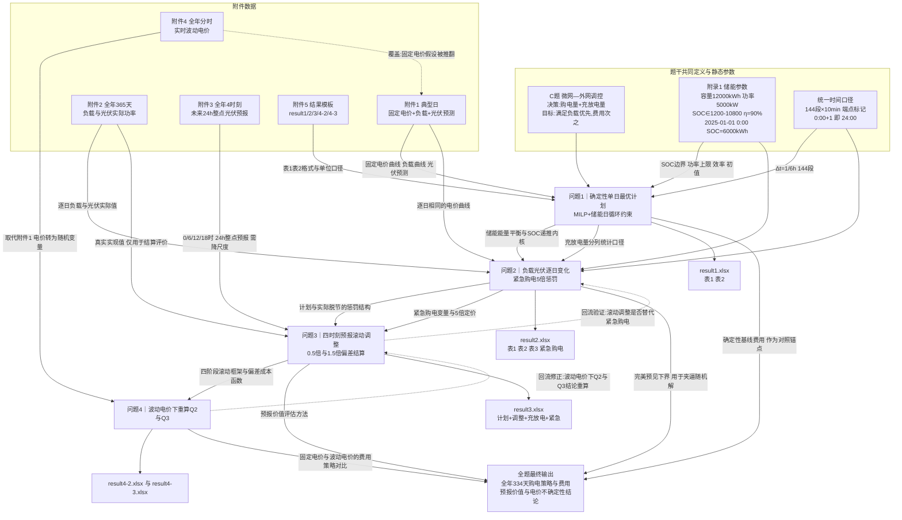

# C题 微网与外部电网电力调控策略 — 题意逐句翻译与联动分析

> 源文件：`E:\数模\26国赛\C题\C题.pdf`（共 3 页）
> 题意锚点：`C 题  微网与外部电网电力调控策略`
> 已排除的题名前样板：`2026 年高教社杯全国大学生数学建模竞赛题目`、`（请先阅读"全国大学生数学建模竞赛论文格式规范"）`、页码 `1/2/3`。以上 3 项不计入覆盖台账。
> 配套数据：`附件1.xlsx`—`附件4.xlsx`、`附件5\result1/2/3/4-2/4-3.xlsx`

---

## 1. 整题概览

**研究对象**：一个**非孤岛式（并网型）微网**，由光伏发电、储能设备、小区负载三部分组成，并与外部电网之间存在双向的电力交易通道（购电侧）。

**已知信息**：小区负载曲线、光伏发电功率（预测值/实际值/预报值三种口径）、分时电价（固定电价与实时波动电价两种口径）、储能设备的物理参数与初始状态。

**核心机制**：储能设备是唯一的跨时段耦合元件——在低电价或光伏有剩余的时段充电，在高电价时段放电，用"能量在时间上的搬移"换取购电费用下降；购电是外生补充手段，用于填补"负载 − 光伏 − 放电"的缺口。

**必须作出的决策**：每一个 10 分钟时段的**计划购电量**，以及储能设备的**充电量 / 放电量**；后续问题还要给出**紧急购电量**与**调整购电量**。

**目标与约束的优先级**：首先是**硬性的供电可靠性**（微网提供的电能不可低于小区负载），其次才是**购电费用最小化**。题目明确用"不可低于"表述前者、用"尽可能节省"表述后者，因此可靠性是不可违约的约束，费用是优化目标，二者不可加权合并。

**四问的推进逻辑**：

| 问题 | 新引入的现实因素 | 由此产生的新机制 |
|---|---|---|
| 问题 1 | 无（理想基准） | 确定性单日最优调度，储能日循环 |
| 问题 2 | 负载与光伏逐日变化 | 计划与实际脱节 → 紧急购电（5 倍电价） |
| 问题 3 | 光伏可在 0/6/12/18 时滚动获得预报 | 计划可按新预报调整 → 偏差结算（50% / 150%） |
| 问题 4 | 电价本身实时波动 | 把问题 2、3 的结论放到随机电价下重算 |

这是一条典型的 **「确定性基准 → 引入源荷不确定性 → 引入滚动预报与调整 → 引入价格不确定性」** 的递进链，与 C 题"特殊数据结构—现实机制—可验证决策"的稳定内核一致。

---

## 2. 逐句题意翻译与联动表

| 编号 | 题干原句 | 通俗而精确的翻译 | 明示条件/数据 | 隐含建模信号 | 与前后内容的联动 | 漏读后果 | 后文必须出现的证据 | 位置 |
|---|---|---|---|---|---|---|---|---|
| B01 | 微网是为解决光伏发电等分布式能源本地消纳，减少并网问题而快速发展起来的小型发用电系统。 | 微网 = 光伏 + 储能 + 负载 的小型自治系统；其存在意义是"让光伏就地被用掉"，而不是倒送回大电网。 | 系统边界：光伏、储能、小区负载、外网连接点 | 背景句但含**机制约束**：定位为"本地消纳"，暗示**不鼓励（也未给出）向电网售电的通道与电价**，多余光伏只能弃掉的或存入储能 | 为"弃光变量"和"无上网收益"提供依据 | 误设"卖电收入"项，使目标函数与费用核算全部错误 | 论文中明确声明"**不考虑余电上网售电，多余光伏计入弃光**" | P1 |
| B02 | 出于经济方面的考虑，非孤岛式微网可在外部电网（以下简称外网）电价较低或分布式能源有剩余电量的时间段，为储能设备充电，并在外网电价较高的时间段释放电能。 | 储能的唯一经济价值是**时移套利**：低谷/光伏富余时充，高峰时放；"非孤岛式"意味着可以并网购电。 | 外网 = 外部电网（术语定义）；套利方向 = 低充高放 | 定义了**决策的经济动机**与**储能的作用**；"分布式能源有剩余电量"是**除低电价之外的第二个充电触发条件**，说明充电决策同时受价格与光伏余量驱动 | 决定目标函数的成本结构与储能调度逻辑；四问通用 | 只按电价排序做"谷充峰放"，忽略中午光伏大发时段的充电机会，损失大量套利空间 | 充放电曲线应显示"夜间低谷 + 正午光伏富余"**两个充电窗口** | P1 |
| B03 | 微网与外网的调控目的是：利用小区负载、光伏发电量和储能设备的当前储电量等数据，尽可能精准地给出微网的购电量和储能设备的充放电量，使得微网提供的电力既能满足小区的负载，又尽可能节省微网的购电费用。 | 输入 = 负载 + 光伏 + 当前储电量（SOC）；输出 = 购电量 + 充放电量；双目标 = 先满足负载（硬），再最小化购电费（软）。 | 决策变量清单；输入数据清单 | ①"**当前储电量**"是**状态变量**，意味着逐日/逐时递推，不是每天独立；②"尽可能精准"指**决策精度**，不是预测精度；③"既能…又尽可能…"是**字典序优先级**，不是加权 | 定义全文统一的决策变量与状态变量；SOC 初值由附录 1 给出 | 把可靠性与费用加权求和，导致出现"故意少供电省钱"的荒谬解 | 目标函数只含费用项；"供电≥负载"写成硬约束；两优先级分开表述 | P1 |
| Q1-01 | 若每天的电价和小区负载相同，同时给出光伏发电功率一天的预测数据，要求微网提供的电能不可低于小区负载，且储能设备在 0:00 和 24:00 的储电量相同。 | 问题 1 的假设：①电价曲线每天一样；②负载曲线每天一样；③光伏给出**一天的预测数据**；④供电 ≥ 负载（硬约束）；⑤**储能日循环约束**：S(0:00) = S(24:00)。 | 典型日数据来自附件 1；储能日循环 | ①"每天相同" ⇒ 只需优化**一个典型日**，全年逐日结果由同一策略重复得到；②"预测数据"⇒ 问题 1 处在**确定性**框架，无预测误差、无紧急购电；③日循环约束使单日问题**自洽封闭**，不需跨日 SOC 初值 | 日循环约束是问题 1 独有的边界条件；问题 2/3/4 未重申，是否沿用是重大口径分歧（见 §3） | 漏掉日循环约束会导致"把电池放空"的假最优；误把问题 1 当成多日问题会白算 | 优化结果中 0:00 与 24:00 储电量数值相等；表 2 两格必须一致 | P1 |
| Q1-02 | 请在每天 0:00 制定微网当天的计划购电策略的数学模型。 | 决策时刻 = 每天 0:00；决策范围 = 当天 0:00–24:00 全时段；产出 = "计划购电策略"的**数学模型**。 | 决策时点 0:00；计划期 24 h | "**在 0:00 制定**"是**信息边界**：0:00 之后发生的任何信息在制定计划时不可用（这是全部后续问题的信息约束源头）；"数学模型"要求给出**通用可复用**的模型，而非某一天的一组数 | 为问题 2/3/4 建立"0:00 计划"这一共同动作与共同信息边界 | 在 0:00 的计划中使用了全天实际数据而不自知，模型失去意义 | 论文中显式列出"0:00 可获取信息集" | P1 |
| Q1-03 | 根据附件 1 和附录 1 中的数据，给出具体的计划购电策略，在论文中以表 1 的格式给出指定时间段的购电量（单位：kWh）及全天的购电量（单位：kWh）和购电费（单位：元）， | 问题 1 的数据源 = 附件 1（典型日）+ 附录 1（储能参数）；交付：表 1（6 个 10 分钟时段购电量 + 全天购电量 + 全天购电费）。 | 数据源指定；表 1 格式与单位 kWh / 元 | **购电量是"电量"（kWh）不是"功率"（kW）**；指定时段为 10:00-10:10、12:00-12:10、14:00-14:10、16:00-16:10、18:00-18:10、20:00-20:10，跨越了"正午光伏大发"与"晚高峰"两类典型工况 | 表 1 格式在问题 2/3/4 中被反复复用（"按表 1 和表 2 的格式"） | 单位写错（kW 与 kWh 混用）导致数值差 6 倍；漏算全天购电费 | 表 1 六格 + 全天购电量 + 全天购电费；单位标注 | P1 |
| Q1-04 | 以表 2 的格式给出储能设备在指定时间段的充放电量及 0:00 和 24:00 的储电量（单位：kWh）， | 交付表 2：0:00-4:00、4:00-8:00、8:00-12:00、12:00-16:00、16:00-20:00、20:00-24:00 六段的**充电量 / 放电量**（分列），以及 0:00 和 24:00 的**储电量**。 | 表 2 格式；单位 kWh | 表 2 的时段是 **4 小时粒度**，而表 1 是 **10 分钟粒度**——同一结果两套粒度，说明必须先按 10 分钟建模、再聚合到 4 小时；充放电量**分两列**意味着"净充放电"不够，必须分开统计 | 表 2 格式在问题 2/3/4 中复用 | 直接按 4 小时粒度建模，损失储能功率约束精度（5000 kW × 4 h = 20000 kWh > 容量 12000 kWh，约束失真） | 表 2 六行 × 充/放两列 + 两个时刻储电量 | P1 |
| Q1-05 | 并将完整的计划购电策略保存到文件 result1.xlsx 中（模板文件见附件 5）。 | 完整策略（全部 144 个 10 分钟时段）写入 result1.xlsx 的"计划购电量"与"充放电量"两个工作表。 | 交付文件；模板约束 | result1 只需**一天**（144 行），而 result2/3/4 需要 **2025.2.1–12.31 共 334 天**——规模差 334 倍，算法必须可批量化 | result1 的模板结构定义了后续所有结果文件的骨架 | 只填了表 1/表 2 的指定格而未填完整 144 段 | result1.xlsx 两个工作表填满 | P1 |
| T1 | 表 1  微网在指定时间段的购电量及全天的购电量和购电费（列：时间段/购电量 ×3 组 + 全天购电量/全天购电费） | 表 1 结构：三组"时间段—购电量"并列 + 全天合计两格。 | 6 个指定时段 | 时段为**单点 10 分钟**，不是累计到该时刻 | — | 与表 2 的 4 小时粒度混淆 | 表 1 按模板填 | P1 |
| T2 | 表 2  储能设备在指定时间段的充放电量及 0:00 和 24:00 的储电量（列：时间段/充电量/放电量 ×2 组 + 0:00 储电量/24:00 储电量） | 表 2 结构：六段 ×（充电量, 放电量）+ 两个时刻的储电量。 | 6 个 4 小时段 | 同一段内充、放**分别统计**；0:00 与 24:00 储电量在问题 1 中应相等 | — | 用"净充电量"一格代替充/放两列 | 表 2 按模板填 | P1 |
| Q2-01 | 若每天的电价相同，而小区负载和光伏发电功率随时间变化，且微网提供的电能不可低于小区负载，如果低于负载，需向外网紧急购电，其电价是交易时刻电价的 5 倍。 | 问题 2 的假设：①电价曲线每天相同（沿用附件 1）；②负载与光伏逐日变化（来自附件 2）；③供电不足的部分**必须**紧急购电，单价 = **该交易时刻电价的 5 倍**。 | 5 倍惩罚系数；紧急购电机制 | ①"紧急"意味着这是**事后被动补购**，不是可主动选择的购电渠道；②"交易时刻电价"指**该时段自己的电价**，不是日均电价；③供电约束从问题 1 的**硬约束**退化为**可违约但罚 5 倍**的软约束 | 紧急购电机制延续到问题 3（"总费用包括…紧急购电费用"）与问题 4 | 用日均电价 ×5 计算，导致费用与时段错配；或把 5 倍当成对整个购电量的惩罚 | 紧急购电费用 = Σ 5·p_t·E_t（E_t 为该时段紧急购电量） | P1 |
| Q2-02 | 除紧急购电费用外，其他时间段的购电费用均按计划购电量计算。 | 结算规则：**按计划购电量收费，而不是按实际用电量收费**。计划外的缺口走紧急购电（5 倍），计划内的部分即使没用掉也照付。 | 结算口径 = 计划购电量 | 这是**非对称损失**结构：计划偏多 → 白付 1 倍；计划偏少 → 缺口付 5 倍。因此最优计划必然是**在"多买的沉没成本"与"少买的 5 倍风险"之间权衡**，而非简单等于期望需求 | 该结算口径是问题 3 中 50%/150% 偏差结算的前身 | 误按"实际购电量"结算，整个不确定性建模失去意义 | 论文明确写出结算公式；计划与实现分别列变量 | P1 |
| Q2-03 | 请在每天 0:00 制定微网当天的计划购电策略。 | 同 Q1-02：决策时刻固定为每天 0:00。 | 决策时点 | 重申信息边界，问题 2 同样不得使用 0:00 之后的信息 | 与问题 3 的"其他预报时刻制定调整策略"形成对照 | — | — | P1 |
| Q2-04 | 根据附件 1 中的电价和附件 2 中的数据，在每天 0:00 制定当天的计划购电策略。 | 问题 2 的数据源 = 附件 1 的**电价** + 附件 2 的**负载与光伏**。 | 数据源指定 | **关键歧义点**：附件 2 名为"光伏发电**实际**功率"，但问题 2 未提供任何预报数据 ⇒ 附件 2 必须**同时**充当"0:00 可获得的规划依据"与"当天的真实实现"。这决定了紧急购电是否为 0（见 §6 第 1 条） | 决定问题 2 的建模口径，并影响问题 4（result4-2） | 口径未声明，表 3 无法填写；评审质疑模型自相矛盾 | 论文必须**显式声明所采口径**并给出对照实验 | P1 |
| Q2-05 | 在论文中按表 1 和表 2 的格式给出表 3 中指定日期的结果，按表 3 的格式给出紧急购电的结果， | 交付：对**表 3 指定的 4 个日期**，各给一套表 1（购电量）+ 表 2（充放电）+ 表 3（紧急购电）。 | 4 个指定日期 | 表 1/表 2 的"指定时间段"不变，但"指定日期"由表 3 给出 ⇒ 同一格式要套用 4 次 | — | 只算了一天，或格式与表 1/表 2 不一致 | 4 个日期 × (表 1 + 表 2 + 表 3) | P1 |
| Q2-06 | 并将完整的购电策略保存到文件 result2.xlsx 中（模板文件见附件 5）。 | result2.xlsx 三个工作表：计划购电量（334 天 × 144 段）、充放电量、紧急购电量。 | 交付文件 | 结果期为 **2025.2.1–12.31（334 天）**，**不含 1 月** ⇒ 1 月是预热/样本内期（见 §6 第 3 条） | 与 result3/result4-2/result4-3 的日期范围一致 | 从 1 月 1 日开始输出，行数与模板不符 | result2.xlsx 三个工作表日期严格为 2025-02-01 起 | P1 |
| T3 | 表 3  微网在指定日期的紧急购电量（2025.3.20 / 2025.6.21 / 2025.9.23 / 2025.12.21） | 表 3 结构：4 个日期并列，每列"时间段—购电量"。 | 4 个指定日期 | 这 4 天恰好是**春分、夏至、秋分、冬至**——题目刻意选取四季代表日，要求结果能体现**光伏出力的季节差异**（夏季紧急购电应显著少于冬季） | 同一组日期在问题 3、问题 4 中反复要求给出 | 未做季节对比分析，只把 4 天当随机抽样日 | 4 个日期的紧急购电量 + 季节性解释 | P2 |
| Q3-01 | 在每天 0:00、6:00、12:00 和 18:00 可获得未来 24 小时整点的光伏发电功率预报。 | 每天**4 个预报发布时刻**，每次发布**未来 24 小时**、**整点（1 小时）粒度**的光伏预报。 | 4 个发布时刻；24 h 预报时长；1 h 粒度 | ①预报是**整点值**，而决策与结算是 **10 分钟**粒度 ⇒ 必须做**降尺度/插值对齐**（重大口径问题，见 §6 第 5 条）；②"未来 24 小时"意味着 6:00 发布的预报会**跨到次日 6:00**，涉及跨日光伏；③四个时刻间隔 6 小时，把一天切成 0-6、6-12、12-18、18-24 四个**决策阶段** | 直接决定问题 3 的滚动结构；预报数据来自附件 3 | 直接把整点预报当 10 分钟值用，或忽略跨日部分 | 论文给出预报降尺度方法；四阶段决策时刻图 | P2 |
| Q3-02 | 可根据 0:00 的预报，制定当天的计划购电策略，也可根据其他时刻的预报，调整购电策略。 | 0:00 → 制定**计划**；6:00/12:00/18:00 → 制定**调整**。"可"字表明调整是**可选动作**，需要论证其必要性。 | 计划 = 0:00；调整 = 其余 3 个时刻 | 最后一问"请分析是否需要引入其他时刻的预报"正是要求**量化论证**这个"可"字 ⇒ 必须做**对照实验**（只用 0:00 vs 用全部 4 个时刻） | 与 Q3-09 直接呼应，构成问题 3 的收尾论证 | 直接默认"必须用"，缺少对照与结论 | 全年总费用对比："仅 0:00" vs "0:00+6/12/18" | P2 |
| Q3-03 | 计划购电量高于调整购电量的部分，违约电价是交易时刻电价的 50%。 | 若某时段 **计划 > 调整**，差额部分按 **0.5 × 该时刻电价** 结算。 | 50% 系数 | 注意语义："违约**电价**是…的 50%"＝这部分仍要按 0.5 倍价**付钱**（少用不退，只打折），**不是**额外罚款、也不是退还。因此"计划偏多"的实际成本 = 0.5·p·(计划−调整) | 与 Q3-04 构成 0.5 / 1.5 的**非对称偏差定价** | 理解为"罚款 50%"或"退还 50%"，费用算反 | 偏差费用公式分段写出 | P2 |
| Q3-04 | 调整购电量高于计划购电量的部分，超出部分的电价是交易时刻电价的 1.5 倍。 | 若某时段 **调整 > 计划**，超出部分按 **1.5 × 该时刻电价** 结算。 | 150% 系数 | 与 Q3-03 合成：偏差单价 = p × (0.5 若计划偏多 / 1.5 若计划偏少)，**偏少代价是偏多的 3 倍** ⇒ 最优计划应**系统性偏保守（略偏多）** | 与 Q2-02 的"按计划量结算"叠加 | 把两个方向都当成 1.5 倍 | 分段线性偏差成本函数 | P2 |
| Q3-05 | 总的购电费用包括计划购电费用、紧急购电费用和调整购电量的相关费用。 | 问题 3 总费用 = ①计划购电费用 + ②紧急购电费用 + ③调整偏差费用（0.5/1.5 两部分）。 | 三项费用构成 | ①项按**计划购电量**结算（沿用 Q2-02），②、③项是对"计划与实际不符"的**叠加惩罚**，说明问题 3 中一次偏差可能同时触发紧急购电与调整费用，需明确二者的**时序先后与不重复计入**规则 | 与 Q2-01（5 倍）、Q3-03/04（0.5/1.5 倍）共同构成完整的成本函数 | 费用项重复计算或漏算 | 总费用公式完整列出三项 | P2 |
| Q3-06 | 请在上述条件下，建立微网当天购电策略的数学模型。 | 要求给出问题 3 的**通用数学模型**（含四阶段滚动结构）。 | 建模要求 | "当天购电策略"包含计划 + 调整两套决策 ⇒ 模型是**多阶段**的 | — | 只建模了 0:00 一步 | 多阶段模型表述 | P2 |
| Q3-07 | 根据附件 1 中的电价、附件 2 中的小区负载和光伏发电及附件 3 的光伏发电预报数据，在每天 0:00 制定当天的计划购电策略，在其他预报时刻制定调整购电策略。 | 问题 3 的数据源 = 附件 1（电价）+ 附件 2（负载与光伏**实际值**，用于结算/评价）+ 附件 3（预报，用于决策）。 | 三份数据源及其角色 | **关键**：附件 2 在此处明确扮演"**真实实现**"角色，附件 3 扮演"**决策信息**"角色 ⇒ 反证在问题 2 中，附件 2 同时承担两个角色（见 §6 第 1 条） | 澄清问题 2 的口径分歧 | 用附件 2 的实际值去做决策（信息偷用），模型变成"上帝视角" | 决策只用附件 3，评价只用附件 2，论文中显式区分 | P2 |
| Q3-08 | 请在论文中按表 1、表 2 和表 3 的格式给出表 3 中指定日期的结果，并将完整的购电策略保存到文件 result3.xlsx 中（模板文件见附件 5）。 | 交付：4 个指定日期的表 1/表 2/表 3 + result3.xlsx（四个工作表：计划购电量、调整购电量、充放电量、紧急购电量）。 | 交付文件；四个工作表 | 比 result2 多一个"**调整购电量**"工作表；"充放电量"与"紧急购电量"要求填**最终**值（即滚动执行后的实际结果），不是计划值 | 与 result2 的结构差异需严格对应 | 把计划值当成最终值填入 | result3.xlsx 四个工作表 | P2 |
| Q3-09 | 请分析是否需要引入其他时刻的预报制定调整购电策略。 | **明确的分析型子问**：用数据论证"多引入 6/12/18 时的预报"是否划算。 | 分析性交付 | 这是**可证伪的结论型**要求，需要一个明确的量化判据（如全年总费用下降幅度、下降幅度是否超过预报获取成本、不同季节的差异），而不是一句"有必要" | 问题 3 的收束，也呼应 Q3-02 的"可"字 | 无对照实验、无量化结论 | 全年费用对比表 + 明确结论 + 分季节讨论 | P2 |
| Q4-01 | 实际上，外网的电价也是实时波动的。 | 推翻问题 1/2/3 中"电价已知且固定（或每日相同）"的假设，电价改为**实时波动**。 | 假设变更 | 电价从**确定性参数**升级为**随机变量/时间序列** ⇒ 储能套利策略从"按已知峰谷搬运"变为"在价格波动中决策"，风险与机会同时放大 | 问题 4 的全部动因 | 仍用附件 1 的固定电价做问题 4 | 论文中明确"电价不确定性"的处理方式 | P2 |
| Q4-02 | 请针对波动电价，建立微网当天购电策略的数学模型。 | 建立**电价随机环境下**的购电策略模型。 | 建模要求 | 模型必须能接受"电价不是一个确定序列"这一输入形态（情景集 / 分布 / 鲁棒区间 / 预测+滚动） | — | 只换数据不换模型，未体现随机性 | 随机/鲁棒/滚动模型的公式 | P2 |
| Q4-03 | 根据附件 2 中的小区负载和光伏发电、附件3 中的光伏发电预报和附件 4 中的电价数据，在波动电价下重新计算问题 2 和问题 3。 | 问题 4 的实质 = **问题 2 与问题 3 在波动电价下的重算**，数据源用附件 2（负载/光伏实际）+ 附件 3（预报）+ 附件 4（波动电价）。 | 数据源；两个重算任务 | **附件 1 的电价在问题 4 中被附件 4 取代**（问题 4 未提及附件 1）；问题 4 因此**不是新的一问，而是对前两问的稳健性重算** ⇒ 论文的核心价值在于**对比**：固定电价 vs 波动电价下的策略与费用差异 | 与问题 2、3 形成"回流验证"关系 | 把问题 4 当成独立新问，缺少与问题 2/3 的对比 | 问题 2/3 与问题 4-2/4-3 的费用与策略对比表 | P2 |
| Q4-04 | 请在论文中给出相应的计算结果，并将完整购电策略分别保存到文件 result4-2.xlsx（对应于问题 2）和 result4-3.xlsx（对应于问题 3）中（模板文件见附件 5）。 | 交付：result4-2.xlsx（波动电价下问题 2 的全部结果，结构同 result2）、result4-3.xlsx（波动电价下问题 3 的全部结果，结构同 result3）。 | 两个交付文件 | 文件结构须与 result2 / result3 **逐表对应**，便于评审做同口径对比 | — | 表结构与 result2/result3 不一致，无法对比 | 两个文件结构对齐 | P2 |
| A1-01 | 储能设备的最大容量为 12000 kWh，最大充放电功率为 5000 kW。 | 容量上限 12000 kWh；充、放功率上限均为 5000 kW。 | 12000 kWh；5000 kW | **量纲陷阱**：容量是 kWh，功率是 kW。10 分钟时段内最大充/放电量 = 5000 kW × (1/6) h ≈ **833.33 kWh**，不是 5000 kWh | 全文通用 | 单位混用，约束放大 6 倍 | 约束写作 C_t, D_t ≤ 5000·Δt = 833.33 kWh | P2 |
| A1-02 | 假设 2025 年 1 月 1 日 0:00 的电量为 6000 kWh。 | 初始 SOC = 6000 kWh（恰好是可用区间的中点）。 | S(2025-01-01 0:00) = 6000 kWh | 只给了**全年起点**一个初值 ⇒ 若 SOC 跨日连续，则每一天的起始 SOC 由前一日的运行决定 ⇒ **逐日之间存在状态耦合**，不能独立求解 | 与 result2/3/4 从 2 月 1 日开始输出直接相关 | 每天重置为 6000，违背状态递推 | 论文说明 SOC 初值如何传导到 2025-02-01 | P2 |
| A1-03 | 为了避免过度充电或放电，在后继的充放电过程中，储能设备的电量必须保持在 1200-10800 kWh 之间，储能设备的充放电效率为 90%。 | 任何时刻 SOC ∈ [1200, 10800] kWh（即容量的 10%–90%）；充放电效率 90%。 | SOC 区间；效率 0.9 | ①可用容量 = 10800 − 1200 = **9600 kWh**；②**效率口径歧义**：90% 是"单程效率（往返 81%）"还是"往返效率（单程 ≈94.87%）"？两种写法年费用差可达数万元，必须做敏感性分析（见 §6 第 2 条）；③"在后继的充放电过程中"限定该区间约束适用于**运行之后**，初始 6000 本身在区间内，无冲突 | 全文通用硬约束 | 效率口径未声明导致结果不可复现；SOC 越界 | 敏感性分析：η=0.9 单程 vs 往返 0.9 两种结果 | P2 |
| A2-01 | 附件 1 提供某天不同时间的电价（单位：元/kWh）、小区负载（单位：kW）和光伏发电预测功率（单位：kW），表中的 0:00+1 表示第二天凌晨 0:00，即当天 24:00（下同）。 | 附件 1 = 一个典型日的三条曲线；时间列采用**区间端点标记法**，最后一行 `0:00+1` = 当天 24:00。 | 时间口径定义；单位 | **"下同"**＝附件 2、附件 4 也采用同一时间标记法 ⇒ 每天 **144 个 10 分钟时段**（00:10 … 23:50, 0:00+1），覆盖 [0:00, 24:00)；第一天第一个点是 00:10 而非 00:00，说明**标记的是区间右端点** | 统一全文时间离散化口径 | 误认为 145 或 143 个数据点；时间点与区间错位 10 分钟 | 论文说明"144 段、端点标记、Δt=1/6 h" | P2 |
| A2-02 | 附件 2 提供 2025.1.1-12.31 每天不同时间的小区负载（单位：kW）和光伏发电实际功率（单位：kW）。 | 附件 2 = 全年 365 天 × 144 段的负载与光伏**实际**功率。 | 365 天；"实际"口径 | "**实际**"二字是关键：它是对照基准（真值），在问题 3/4 中用于结算与评价；在问题 2 中它还必须兼作规划输入（见 Q2-04） | 问题 2/3/4 共用 | 与附件 3 的"预报"角色混淆 | 论文中区分"决策用预报 / 结算用实际" | P2 |
| A2-03 | 附件 3 提供 2025.1.1-12.31 每天 0:00、6:00、12:00 和 18:00 发布的未来 24 小时整点的光伏发电功率预报（单位：kW）。 | 附件 3 = 365 × 4 = 1460 条预报，每条 24 个整点值。 | 1460 条；24 个整点 | 与附件 2 的 10 分钟粒度**不一致** ⇒ 必须降尺度；且"未来 24 小时"会跨日到次日 | 问题 3/4 的决策信息源 | 粒度错配；跨日部分被截断 | 降尺度方法 + 跨日拼接说明 | P2 |
| A2-04 | 附件 4 提供 2025.1.1-12.31 每天不同时间的电价（单位：元/kWh）。 | 附件 4 = 全年 365 天 × 144 段的分时电价（替代附件 1 的固定电价）。 | 365 天；144 段 | 与附件 1 电价**同均值（0.7662 元/kWh）但波动显著更大**（日内极差均值 1.1073，最大 1.4995；附件 1 仅 1.0239）⇒ 套利空间扩大，但决策风险也扩大 | 问题 4 专用 | 沿用附件 1 电价 | 附件 1 与附件 4 电价的统计对比表 | P2 |
| A2-05 | 附件 5  结果文件夹（result1 / result2 / result3 / result4-2 / result4-3 的工作表与保存内容说明） | 附件 5 是结果模板，规定了每个文件的**工作表名、行列结构、日期范围、单位**。 | 5 个文件的结构 | 模板是**可复算的硬约束**：评审会直接打开 xlsx 校验行数、日期、单位 | 全部四问 | 结构不符直接失分 | 五个文件逐个核对 | P3 |
| R2-01 | result2.xlsx：在"计划购电量"工作表中保存 2025.2.1-12.31 每天 0:00 制定的间隔 10 分钟的计划购电量（单位：kWh）。 | result2 计划购电量 = 334 天 × 144 段。 | 334 天；10 分钟；kWh | **起止日期被强制为 2025.2.1–12.31** | 见 §6 第 3 条 | 日期范围错误 | 首行 2025-02-01，末行 2025-12-31 | P3 |
| R2-02 | 在"紧急购电量"工作表中保存 2025.2.1-12.31 紧急购电的时间段和购电量（单位：kWh），填写方法如表 4 所示。 | 紧急购电按**连续时间段**合并填报，不是逐 10 分钟一行。 | 表 4 格式 | 表 4 示例中同一天可有多行（13:00-13:30 / 14:40-15:50 / 16:10-16:30）⇒ 需要先识别连续缺电区间，再**合并**成段 | — | 逐段罗列导致行数爆炸、不符合示例 | 连续区间合并算法说明 | P3 |
| R3-01 | result3.xlsx：在"调整购电量"工作表中保存根据其他预报制定的调整购电量（单位：kWh）。 | 调整购电量单独成表，与计划购电量并列。 | 新增工作表 | 调整购电量覆盖**全天 144 段**还是仅覆盖 6:00 之后的时段，需与"已执行部分不可更改"的信息边界一致（见 §6 第 6 条） | — | 把 0:00–6:00 也"调整"了，违背因果 | 论文声明调整的时段范围 | P3 |
| R3-02 | 在"充放电量"工作表中保存储能设备在 2025.2.1-12.31 指定时间段**最终**的充放电量…在"紧急购电量"工作表中保存 2025.2.1-12.31 **最终**的紧急购电时间段与购电量。 | 问题 3 的充放电与紧急购电填的是**滚动执行后的最终结果**，不是 0:00 的计划值。 | "最终"口径 | 明确区分**计划值 / 调整值 / 实际执行值**三层 | 与 Q3-08 呼应 | 用计划值冒充最终值 | 三层结果的对照表 | P3 |
| R4-01 | 在 result4-2.xlsx 中保存波动电价下问题 2 的全部结果；在 result4-3.xlsx 中保存波动电价下问题 3 的全部结果。 | 两个文件分别复刻 result2 / result3 的完整结构。 | 结构对应 | 必须**逐表对齐**，否则无法与问题 2/3 对比 | 与 Q4-03/04 呼应 | 结构不一致 | 结构对齐核对表 | P3 |

---

## 3. 核心术语与口径表

| 术语 | 题目原始定义 | 建议采用的精确口径 | 单位/范围 | 影响问题 | 歧义或注意事项 |
|---|---|---|---|---|---|
| 微网提供的电能 | "微网提供的电能不可低于小区负载" | 计划购电量 + 光伏可上网电量 + 储能放电量 − 充电量 ≥ 负载电量 | kWh（逐 10 min 段） | 全部 | 是否把"紧急购电"计入"提供"？建议**不计入**（它是违约后的补救，不是提供） |
| 小区负载 | 附件 1/2 的"小区负载" | 时段平均功率 × Δt = 时段电量 | kW → kWh | 全部 | 负载是**刚性**需求，无需求响应，不可削峰 |
| 光伏发电预测功率 | 附件 1 列名 | 问题 1 的唯一光伏口径，视为**无误差** | kW | 问题 1 | — |
| 光伏发电实际功率 | 附件 2 列名 | 全天真实实现值，用作**结算与评价基准** | kW | 问题 2/3/4 | 问题 2 中还需兼作规划输入（见下条） |
| 光伏发电预报 | 附件 3 | 0:00 可获得的决策信息；1 小时粒度，需降尺度到 10 min | kW | 问题 3/4 | 与附件 2 实际值存在系统性偏差（见 §6 第 5 条） |
| 计划购电量 | "请在每天 0:00 制定…计划购电策略" | 0:00 锁定的逐时段购电合同量，**结算依据** | kWh | 全部 | 计划量 ≠ 实际提货量，二者必须分成两个变量 |
| 紧急购电量 | "如果低于负载，需向外网紧急购电" | 实际供电缺口，单价 5·p_t | kWh | 问题 2/3/4 | 被动触发，不可主动"选择"用来套利 |
| 调整购电量 | "根据其他时刻的预报，调整购电策略" | 6/12/18 时对**尚未执行时段**的计划修正量 | kWh | 问题 3/4 | 已执行时段（0:00–当前）**不可调整** |
| 交易时刻电价 | "其电价是交易时刻电价的 5 倍" | 该 10 分钟时段的电价 p_t，**不是日均电价** | 元/kWh | 问题 2/3/4 | 与"全天平均电价"严格区分 |
| 储电量（SOC） | 附录 1 | S_t ∈ [1200, 10800]，S(2025-01-01 0:00) = 6000 | kWh | 全部 | 容量上限 12000 是**物理**容量，SOC 区间是**运行**限制 |
| 充放电效率 90% | 附录 1 | **主口径**：充电 η_c = 放电 η_d = 0.90（往返 81%）；**对照口径**：往返 0.90（单程 0.9487） | — | 全部 | 必须做敏感性分析并在论文中声明 |
| 0:00 和 24:00 储电量相同 | 问题 1 明文 | 问题 1 强制 S_0 = S_144；问题 2/3/4 **建议沿用**（见 §6 第 4 条） | kWh | 问题 1（强制）/ 2/3/4（建议） | 未沿用则需另设终端约束，否则电池被放空 |
| 时间段（表 1） | 10:00-10:10 等 | 单点 10 分钟区间的电量 | kWh | 全部 | 与表 2 的 4 小时段不同粒度 |
| 时间段（表 2） | 0:00-4:00 等 | 4 小时区间的**充电量/放电量合计**，分两列 | kWh | 全部 | 需先按 10 min 建模再聚合 |
| 0:00+1 | "表示第二天凌晨 0:00，即当天 24:00（下同）" | 每天 144 段，区间右端点标记 | — | 全部 | 附件 2、附件 4 同口径 |
| 非孤岛式微网 | B02 | 可并网购电；题目**未给出**上网售电电价 ⇒ 不建模售电 | — | 全部 | 多余光伏 → 弃光 |
| 弃光 | 题目未出现 | 光伏 − 负载 − 可充电功率 > 0 时的强制弃电量 | kWh | 全部 | **题目未明示但物理上必然存在**，必须显式建模 |

---

## 4. 各问输入—任务—输出表

| 问题 | 直接输入 | 需要解决的任务 | 必须满足的约束 | 最终输出 | 依赖前问内容 | 将被后问复用的内容 |
|---|---|---|---|---|---|---|
| 问题 1 | 附件 1（典型日电价/负载/光伏预测）；附录 1（储能参数） | 建立并求解单日确定性最优购电与充放电模型 | 供电 ≥ 负载；SOC ∈ [1200,10800]；充/放功率 ≤ 5000 kW；**S(0:00)=S(24:00)**；充放电互斥 | 表 1、表 2；result1.xlsx（144 段计划购电量 + 分段充放电 + 两个时刻 SOC） | — | ①储能能量平衡与 SOC 递推内核；②10 分钟离散化口径；③表 1/表 2 格式与单位；④"费用按计划量结算"的默认前提 |
| 问题 2 | 附件 1（电价）；附件 2（全年负载与光伏实际） | 在负载/光伏逐日变化下制定逐日计划购电策略，处理供电缺口 | 供电缺口按 5·p_t 紧急购电；其余约束同问题 1 | 4 个指定日期的表 1/表 2/表 3；result2.xlsx（计划购电量 / 充放电量 / 紧急购电量，2025.2.1–12.31） | 问题 1 的能量平衡内核、SOC 边界、离散化口径 | ①紧急购电惩罚项结构；②"计划—实际—结算"三层变量体系；③多日批量求解框架 |
| 问题 3 | 附件 1（电价）；附件 2（真实值，用于结算）；附件 3（四时刻 24 h 整点预报） | 建立四阶段滚动模型：0:00 计划 + 6/12/18 调整，并论证是否值得引入调整 | 偏差结算：计划>调整按 0.5·p_t，调整>计划按 1.5·p_t；总费用 = 计划 + 紧急 + 偏差 | 4 个指定日期的表 1/表 2/表 3；result3.xlsx（计划 / 调整 / 充放电 / 紧急）；"是否需要引入其他时刻预报"的量化结论 | 问题 2 的三层变量体系、紧急购电机制、批量框架 | ①滚动（MPC）框架；②偏差成本函数；③"预报价值"的评估方法 |
| 问题 4 | 附件 2（负载/光伏实际）；附件 3（预报）；**附件 4（全年分时波动电价，取代附件 1）** | 在电价随机的条件下重算问题 2 与问题 3，并与原结论对比 | 同问题 2 / 问题 3，但 p_t 不再是确定序列 | result4-2.xlsx、result4-3.xlsx；与问题 2/3 的策略与费用对比结论 | 问题 2 与问题 3 的完整模型与结果（作为对照基线） | — |

---

## 5. 跨问题联动链

图中有两条回流边需要特别说明：

- **Q3 → Q2**：问题 3 引入滚动调整后，原本在问题 2 中只能靠"紧急购电 5 倍"兜底的供电缺口，可以在 6:00/12:00/18:00 提前被修正为"1.5 倍调整购电"。因此问题 3 的结果应当反过来验证：紧急购电量是否被显著压低、总费用是否下降。这条边是**评价问题 2 结论稳健性**的依据。
- **Q4 → Q3**：问题 4 把电价从确定性序列换成附件 4 的随机序列后，问题 3 中"是否值得引入其他时刻预报"的结论可能反转（价格不确定性会提高滚动调整的价值），必须重新检验而不是直接照搬。

---

## 6. 最容易漏读或误解的句子

| 优先级 | 原句/关键词 | 常见误读 | 正确理解 | 影响问题 | 建议检查证据 |
|---|---|---|---|---|---|
| 1 | Q2-04「根据附件 1 中的电价和附件 2 中的数据，在每天 0:00 制定当天的计划购电策略」 | 附件 2 是"实际功率"，0:00 就能拿到，所以问题 2 是完美信息问题，紧急购电恒为 0 | 存在两种自洽读法。**读法 A（完美信息）**：0:00 直接以附件 2 当天曲线规划 ⇒ 紧急购电理论上为 0，表 3 填"无"，但表 3 与 result2 的"紧急购电量"工作表将毫无信息量。**读法 B（自建预测 + 结算）**：0:00 只能用**历史**（附件 2 截至前一日）预测当天负载与光伏，附件 2 当天值作为**实现**用于结算 ⇒ 紧急购电非零，且**恰好解释了为什么结果期从 2025.2.1 开始（1 月作为预测模型预热期）** | 问题 2、问题 4-2 | **两条都算、论文都报**：以读法 A 作为"完美预见费用下界"，以读法 B 作为主结果并给出预测误差指标（RMSE/MAPE）。二者之差即为"信息价值" |
| 2 | A1-03「储能设备的充放电效率为 90%」 | 直接令 η=0.9 乘在充电上（或放电上）一次 | 90% 既可能是**单程效率**（往返 0.81），也可能是**往返效率**（单程 0.9487）。两种口径下年费用差异显著 | 全部 | 两种口径各跑一遍，给出费用差异与相同的策略结构，说明结论稳健性 |
| 3 | R2-01「保存 **2025.2.1-12.31**…」 | 从附件起始日 2025.1.1 开始输出 | 结果期**强制为 334 天**（2.1–12.31），1 月被排除。这既可能是预测模型的预热期（支持读法 B），也可能是储能 SOC 从 6000 kWh 起始的过渡期 | 问题 2/3/4 | 输出文件首行必须为 2025-02-01；论文说明 1 月如何处理（预热 / SOC 传导） |
| 4 | Q1-01「储能设备在 0:00 和 24:00 的储电量相同」 | 该约束只在问题 1 出现，问题 2/3/4 可以不加 | 题目只在问题 1 **明文**给出，但若不沿用，跨日 SOC 递推的 LP 会在末期把电池放空至 1200 kWh，得到不可信的"伪最优"。**建议四问统一沿用日循环约束**，并把"不沿用 + 设年终端约束"作为对照 | 全部 | 报告 334 天 SOC 轨迹的最低/最高值；给出两种终端处理的年费用对比 |
| 5 | A2-03「未来 24 小时**整点**的光伏发电功率预报」 | 把 24 个整点值直接当成 24 个 10 分钟值，或按 1 小时常值展宽后直接与 10 分钟数据相加 | 附件 2/4 是 **10 分钟**粒度，附件 3 是 **1 小时**粒度，必须降尺度（线性插值 / 按典型日内形状分配）。另外，6:00 发布的预报有 18 小时落到**次日**，涉及跨日拼接 | 问题 3、问题 4-3 | 用附件 2 反算对齐：以"预报第 k 小时 ↔ 实际区间 [k−1, k)"对齐时，0:00 预报全年 RMSE ≈ **563.7 kW**；若错开一小时则为 693.8 kW。这一对比可作为对齐口径的证据 |
| 6 | Q3-01/02「在每天 0:00、6:00、12:00 和 18:00 可获得…」「在**其他预报时刻**制定调整购电策略」 | 6:00 调整时可以重排全天（含 0:00–6:00） | 已执行的 0:00–6:00 时段**不可更改**，调整只能作用于**当前时刻之后**的剩余时段。这是因果性/信息边界的硬要求 | 问题 3、问题 4-3 | 论文画出四阶段决策时刻轴，标注每段的可调整范围；result3 的"调整购电量"在已执行时段应与"计划购电量"一致 |
| 7 | Q3-03「计划购电量高于调整购电量的部分，**违约电价**是交易时刻电价的 50%」 | 理解为"罚款 50%"或"退还 50%" | 是**结算单价**：这部分电量仍要付钱，只是按 0.5·p_t 计价。结合 Q3-04，偏差单价为 0.5p（计划偏多）/ 1.5p（计划偏少），**偏少的代价是偏多的 3 倍** | 问题 3、问题 4-3 | 分段成本函数写成公式；报告全年"计划>调整"与"调整>计划"的电量占比 |
| 8 | A1-01「最大容量 12000 **kWh**，最大充放电功率 5000 **kW**」 | 把 5000 kW 直接当作每时段 5000 kWh 的充放电上限 | 10 分钟时段上限 = 5000 kW × 1/6 h ≈ **833.33 kWh** | 全部 | 约束写作 C_t, D_t ≤ 833.33；检查最优解中充放电量是否触及该上限 |
| 9 | B01「本地消纳，减少并网问题」+ 题目通篇未给出上网电价 | 认为多余光伏可以卖给电网获利 | 题目**没有**售电电价，也强调"本地消纳" ⇒ 多余光伏只能**弃掉**（或存入储能）。且光伏最大功率 10216 kW，即使负载处于最低 1996 kW，净剩余 6602 kW 仍**超过**储能最大充电功率 5000 kW ⇒ **弃光物理上不可避免**（全年约 241 个 10 分钟时段，占 0.46%） | 全部 | 模型中显式引入弃光变量；论文报告全年弃光电量 |
| 10 | A2-01「表中的 0:00+1 表示第二天凌晨 0:00，即当天 24:00（**下同**）」 | 认为每天有 145 个数据点（含 0:00 与 24:00 两个端点） | 每天恰有 **144 个 10 分钟时段**（00:10 … 23:50, 0:00+1），标记的是**区间右端点**。"下同"覆盖附件 2 与附件 4 | 全部 | 输出文件列数 = 144 + 1（日期列）= 145 |
| 11 | Q4-03「在波动电价下**重新计算**问题 2 和问题 3」 | 把问题 4 当成独立的新问题，只给出新结果 | 问题 4 的价值在于**对比**：固定电价（附件 1）vs 波动电价（附件 4）下的策略结构、储能利用率、各项费用构成差异 | 问题 4 | 给出问题 2 vs 4-2、问题 3 vs 4-3 的同口径对比表 |
| 12 | T3 指定日期 2025.3.20 / 6.21 / 9.23 / 12.21 | 当成随机抽样的 4 天 | 恰为**春分、夏至、秋分、冬至**，题目刻意要求展示**季节性** | 问题 2/3/4 | 报告中做四季对比：夏季紧急购电应显著低于冬季 |

---

## 7. 完整性核验

| 核验项目 | 结果 | 说明 |
|---|---|---|
| 源文件 | `C题.pdf`，3 页 | 正文与附录均已提取 |
| 题意锚点 | `C 题  微网与外部电网电力调控策略` | 锚点之前的 3 项通用样板已排除，不计入台账 |
| 实质性原文单元数 | 40 | 背景 3 + 问题 1 计 8（含表 1、表 2）+ 问题 2 计 8（含表 3）+ 问题 3 计 10 + 问题 4 计 4 + 附录 1 计 3 + 附录 2 计 4 + 结果文件细则 5 |
| 台账行数 | 40 | 与实质性单元数 1:1 对应，无合并、无省略 |
| 覆盖的编号问题 | 4 | 问题 1、2、3、4 全部进入台账、输入输出表与 Mermaid 图 |
| 覆盖的表格/附录 | 表 1、表 2、表 3、表 4（示例）、附录 1、附录 2 | 全部覆盖 |
| 覆盖的附件 | 附件 1、2、3、4、5（含 result1/2/3/4-2/4-3） | 均已实际打开核验结构与量级 |
| 缺失附件 | 无 | 题目所述附件全部齐备 |
| 附件数据实测要点 | 已核验 | 附件 1/2/4：144 段×10 min，365 天；附件 3：1460 条×24 整点；负载 1995.72–7978.88 kW；光伏峰值 10216.2 kW；附件 4 电价 0.0076–1.7936 元/kWh，无负电价 |
| 未解决的歧义 | 5 项 | ①问题 2 的信息边界（§6-1）；②储能效率 90% 的口径（§6-2）；③结果期从 2.1 起的原因（§6-3）；④日循环约束是否沿用（§6-4）；⑤附件 3 整点预报与 10 分钟决策粒度的对齐（§6-5，已给出数据证据） |
| OCR 不确定性 | 无 | PDF 为文字版，提取结果完整，无缺字 |
| 跨问题联动链完整性 | **通过** | Mermaid 图含 4 个问题节点（Q1/Q2/Q3/Q4）、共同定义子图、数据子图、4 个输出节点、1 个最终输出节点，含 2 条回流验证边与 1 条覆盖边 |
| 无遗漏声明 | **确认** | 自题意锚点（含标题本身）起，至附录 2 结束，全部实质性句子均已进入第 2 节台账，无静默省略 |

> 说明：本报告只做题意翻译与结构分析，**未求解任何问题、未给出任何数值结果**；涉及模型名称处仅用于说明语义信号，不构成选型结论。选型见配套文档《C题-全文建模主线与分问选型.md》与《C题-模型字典适配性审查.md》。
